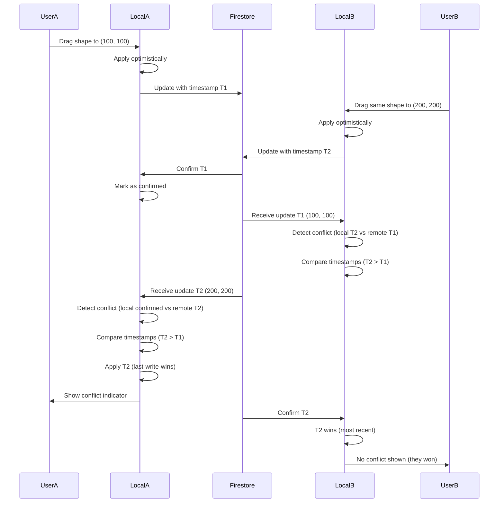

# CollabCanvas - Development Task List

**Project**: CollabCanvas - Real-Time Collaborative Design Tool  
**Owner**: Atharva Sardar  
**Last Updated**: October 15, 2025

---

## Document Structure

This task list contains:
1. **[Phase 1: MVP Tasks](#phase-1-mvp-tasks)** (PR #1-9) - ✅ Completed
2. **[Phase 2: Production Tasks](#phase-2-production-tasks)** (PR #10-27) - 🟡 In Progress
3. **[Environment & Validation](#environment--configuration)** - Configuration and rubric alignment

---

## Project File Structure

**Current Architecture**:

```
collabcanvas/
├── public/
│   └── index.html
├── src/
│   ├── components/
│   │   ├── Auth/
│   │   │   ├── Login.jsx
│   │   │   ├── Signup.jsx
│   │   │   └── AuthProvider.jsx
│   │   ├── Canvas/
│   │   │   ├── Canvas.jsx
│   │   │   ├── CanvasControls.jsx
│   │   │   └── Shape.jsx
│   │   ├── Collaboration/
│   │   │   ├── Cursor.jsx
│   │   │   ├── UserPresence.jsx
│   │   │   └── PresenceList.jsx
│   │   └── Layout/
│   │       ├── Navbar.jsx
│   │       └── Sidebar.jsx
│   ├── services/
│   │   ├── firebase.js
│   │   ├── auth.js
│   │   ├── canvas.js
│   │   └── presence.js
│   ├── hooks/
│   │   ├── useAuth.js
│   │   ├── useCanvas.js
│   │   ├── useCursors.js
│   │   └── usePresence.js
│   ├── utils/
│   │   ├── constants.js
│   │   └── helpers.js
│   ├── contexts/
│   │   ├── AuthContext.jsx
│   │   └── CanvasContext.jsx
│   ├── App.jsx
│   ├── main.jsx
│   └── index.css
├── tests/
│   ├── setup.js
│   ├── unit/
│   │   ├── utils/
│   │   │   └── helpers.test.js
│   │   ├── services/
│   │   │   ├── auth.test.js
│   │   │   └── canvas.test.js
│   │   └── contexts/
│   │       └── CanvasContext.test.js
│   └── integration/
│       ├── auth-flow.test.js
│       ├── canvas-sync.test.js
│       └── multiplayer.test.js
├── .env
├── .env.example
├── .gitignore
├── package.json
├── vite.config.js
├── tailwind.config.js
├── postcss.config.js
├── firebase.json
├── .firebaserc
└── README.md
```

---
---

# Phase 1: MVP Tasks

**Status**: ✅ Completed (PR #1-9)  
**Timeline**: Initial development phase  
**Goal**: Build foundational multiplayer canvas with real-time collaboration

---

## PR #1: Project Setup & Firebase Configuration

**Branch:** `setup/initial-config`  
**Goal:** Initialize project with all dependencies and Firebase configuration

### Tasks:

- [x] **1.1: Initialize React + Vite Project**

  - Files to create: `package.json`, `vite.config.ts`, `index.html`
  - Run: `npm create vite@latest collabcanvas -- --template react-ts`
  - Verify dev server runs

- [x] **1.2: Install Core Dependencies**

  - Files to update: `package.json`
  - Install:
    ```bash
    npm install firebase konva react-konva
    ```

- [x] **1.3: Configure Tailwind CSS**

  - Files to create: `tailwind.config.js`, `postcss.config.js`
  - Files to update: `src/index.css`
  - Run: `npx tailwindcss init -p`
  - Add Tailwind directives to `index.css`

- [x] **1.4: Set Up Firebase Project**

  - Create Firebase project in console
  - Enable Authentication (Email/Password AND Google)
  - Create Firestore database
  - Create Realtime Database
  - Files to create: `.env`, `.env.example`
  - Add Firebase config keys to `.env`

- [x] **1.5: Create Firebase Service File**

  - Files to create: `src/services/firebase.ts`
  - Initialize Firebase app
  - Export `auth`, `db` (Firestore), `rtdb` (Realtime Database)

- [x] **1.6: Configure Git & .gitignore**

  - Files to create/update: `.gitignore`
  - Ensure `.env` is ignored
  - Add `node_modules/`, `dist/`, `.firebase/` to `.gitignore`

- [x] **1.7: Create README with Setup Instructions**
  - Files to create: `README.md`
  - Include setup steps, env variables needed, run commands

**PR Checklist:**

- [x] Dev server runs successfully
- [x] Firebase initialized without errors
- [x] Tailwind classes work in test component
- [x] `.env` is in `.gitignore`

---

## PR #2: Authentication System

**Branch:** `feature/authentication`  
**Goal:** Complete user authentication with login/signup flows

### Tasks:

- [x] **2.1: Create Auth Context**

  - Files to create: `src/contexts/AuthContext.tsx`
  - Provide: `currentUser`, `loading`, `login()`, `signup()`, `logout()`

- [x] **2.2: Create Auth Service**

  - Files to create: `src/services/auth.ts`
  - Functions: `signUp(email, password, displayName)`, `signIn(email, password)`, `signInWithGoogle()`, `signOut()`, `updateUserProfile(displayName)`
  - Display name logic: Extract from Google profile or use email prefix

- [x] **2.3: Create Auth Hook**

  - Files to create: `src/hooks/useAuth.ts`
  - Return auth context values

- [x] **2.4: Build Signup Component**

  - Files to create: `src/components/Auth/Signup.tsx`
  - Form fields: email, password, display name
  - Handle signup errors
  - Redirect to canvas on success

- [x] **2.5: Build Login Component**

  - Files to create: `src/components/Auth/Login.tsx`
  - Form fields: email, password
  - Add "Sign in with Google" button
  - Handle login errors
  - Link to signup page

- [x] **2.6: Create Auth Provider Wrapper**

  - Files to create: `src/components/Auth/AuthProvider.tsx`
  - Wrap entire app with AuthContext
  - Show loading state during auth check

- [x] **2.7: Update App.tsx with Protected Routes**

  - Files to update: `src/App.tsx`
  - Show Login/Signup if not authenticated
  - Show Canvas if authenticated
  - Basic routing logic

- [x] **2.8: Create Navbar Component**
  - Files to create: `src/components/Layout/Navbar.tsx`
  - Display current user name
  - Logout button

**PR Checklist:**

- [ ] Can create new account with email/password
- [ ] Can login with existing account
- [ ] Can sign in with Google
- [ ] Display name appears correctly (Google name or email prefix)
- [ ] Display name truncates at 20 chars if too long
- [ ] Logout works and redirects to login
- [ ] Auth state persists on page refresh

---

## PR #3: Basic Canvas Rendering

**Branch:** `feature/canvas-basic`  
**Goal:** Canvas with pan, zoom, and basic stage setup

### Tasks:

- [x] **3.1: Create Canvas Constants**

  - Files to create: `src/utils/constants.ts`
  - Define: `CANVAS_WIDTH = 5000`, `CANVAS_HEIGHT = 5000`, `VIEWPORT_WIDTH`, `VIEWPORT_HEIGHT`
  - Define: `CANVAS_CENTER_X = 2500`, `CANVAS_CENTER_Y = 2500` (initial view position)
  - Define: `GRID_SPACING = 1000` (for visual grid)

- [x] **3.2: Create Canvas Context**

  - Files to create: `src/contexts/CanvasContext.tsx`
  - State: `shapes`, `selectedId`, `stageRef`
  - Provide methods to add/update/delete shapes

- [x] **3.3: Build Base Canvas Component**

  - Files to create: `src/components/Canvas/Canvas.tsx`
  - Set up Konva Stage and Layer
  - Container div with fixed dimensions
  - Light gray background with subtle grid (1000px spacing)
  - Canvas starts centered at (2500, 2500) for new users
  - Subtle gray border at canvas edges (visual boundary indicator)

- [x] **3.4: Implement Pan Functionality**

  - Files to update: `src/components/Canvas/Canvas.tsx`
  - Enable panning via space bar + drag or middle mouse button
  - Handle `onDragMove` on Stage
  - Constrain panning to canvas bounds (5000x5000px)
  - Prevent objects from being placed/moved outside boundaries

- [x] **3.5: Implement Zoom Functionality**

  - Files to update: `src/components/Canvas/Canvas.tsx`
  - Handle `onWheel` event
  - Zoom to cursor position
  - Min zoom: 0.1, Max zoom: 3

- [x] **3.6: Create Canvas Controls Component**

  - Files to create: `src/components/Canvas/CanvasControls.tsx`
  - Buttons: "Zoom In", "Zoom Out", "Reset View"
  - Position: Fixed/floating on canvas
  - Note: "Add Shape" button removed - shapes created via click-and-drag interaction

- [x] **3.7: Add Canvas to App**
  - Files to update: `src/App.tsx`
  - Wrap Canvas in CanvasContext
  - Include Navbar and Canvas

**PR Checklist:**

- [ ] Canvas renders at correct size (5000x5000px)
- [ ] Canvas starts centered at (2500, 2500)
- [ ] Visual grid with 1000px spacing visible
- [ ] Subtle gray border at canvas edges visible
- [ ] Can pan via space bar + drag or middle mouse button
- [ ] Can zoom with mousewheel
- [ ] Zoom centers on cursor position
- [ ] Reset view button works
- [ ] Canvas boundaries are enforced with visual indicators
- [ ] 60 FPS maintained during pan/zoom

---

## PR #4: Shape Creation & Manipulation

**Branch:** `feature/shapes`  
**Goal:** Create, select, and move shapes on canvas

### Tasks:

- [x] **4.1: Create Shape Component**

  - Files to create: `src/components/Canvas/Shape.tsx`
  - Support: **Rectangles only for MVP**
  - Props: `id`, `x`, `y`, `width`, `height`, `fill`, `isSelected`, `isLocked`, `lockedBy`
  - Visual feedback: Highlighted border when selected, colored border with user badge when locked

- [x] **4.2: Define Shape Color Palette**

  - Files to update: `src/utils/constants.ts`
  - Define: `SHAPE_COLORS = ["#7B68EE", "#FF6B6B", "#4ECDC4", "#45B7D1", "#FFA07A", "#98D8C8", "#FFB6C1", "#DDA15E", "#BC6C25"]`
  - Function: `getRandomShapeColor()` to pick random color from palette

- [x] **4.3: Add Shape Creation Logic (Click-and-Drag)**

  - Files to update: `src/contexts/CanvasContext.tsx`
  - Function: `addShape(type, startPos, endPos)` - creates rectangle from drag start to drag end
  - Generate unique ID for each shape
  - Default properties: random fill color from SHAPE_COLORS palette
  - Minimum size: 10x10px (prevent accidental tiny shapes)
  - Files to update: `src/components/Canvas/Canvas.tsx`
  - Implement click-and-drag rectangle creation (draw mode by default)
  - Show preview rectangle while dragging
  - Finalize shape on mouse release

- [x] **4.4: Implement Shape Rendering**

  - Files to update: `src/components/Canvas/Canvas.tsx`
  - Map over `shapes` array
  - Render Shape component for each

- [x] **4.5: Add Shape Selection**

  - Files to update: `src/components/Canvas/Shape.tsx`
  - Handle `onClick` to set selected
  - Visual feedback: highlighted border when selected
  - Files to update: `src/contexts/CanvasContext.tsx`
  - State: `selectedId`

- [x] **4.6: Implement Shape Dragging**

  - Files to update: `src/components/Canvas/Shape.tsx`
  - Enable `draggable={true}` (separate from draw mode)
  - Handle `onDragEnd` to update position
  - Constrain dragging within canvas boundaries
  - Files to update: `src/contexts/CanvasContext.tsx`
  - Function: `updateShape(id, updates)`

- [x] **4.7: Add Click-to-Deselect**

  - Files to update: `src/components/Canvas/Canvas.tsx`
  - Handle Stage `onClick` to deselect when clicking empty canvas

- [x] **4.8: Add Delete Functionality**
  - Files to update: `src/contexts/CanvasContext.tsx`
  - Function: `deleteShape(id)`
  - Files to update: `src/components/Canvas/Canvas.tsx`
  - Add keyboard listener for Delete/Backspace key
  - Delete selected shape when key pressed
  - Cannot delete shapes locked by other users

**PR Checklist:**

- [ ] Can create rectangles via click-and-drag interaction
- [ ] Preview rectangle shows while dragging
- [ ] Rectangles have random colors from predefined palette
- [ ] Minimum rectangle size enforced (10x10px)
- [ ] Rectangles render at correct positions with random fill colors
- [ ] Can select rectangles by clicking (highlighted border shows)
- [ ] Can drag rectangles smoothly (separate from drawing)
- [ ] Selection state shows visually with highlighted border
- [ ] Can delete selected rectangle with Delete/Backspace key
- [ ] Clicking another shape deselects the previous one
- [ ] Clicking empty canvas deselects current selection
- [ ] Objects cannot be moved outside canvas boundaries
- [ ] No lag with 20+ shapes

---

## PR #5: Real-Time Shape Synchronization

**Branch:** `feature/realtime-sync`  
**Goal:** Sync shape changes across all connected users

### Tasks:

- [x] **5.1: Design Firestore Schema**

  - Collection: `canvas` (single document: `global-canvas-v1`)
  - Document structure:
    ```
    {
      canvasId: "global-canvas-v1",
      shapes: [
        {
          id: string,
          type: 'rectangle',
          x: number,
          y: number,
          width: number,
          height: number,
          fill: string (random color from SHAPE_COLORS palette),
          createdBy: string (userId),
          createdAt: timestamp,
          lastModifiedBy: string,
          lastModifiedAt: timestamp,
          isLocked: boolean,
          lockedBy: string (userId) or null,
          lockedByColor: string (cursor color of locking user) or null
        }
      ],
      lastUpdated: timestamp
    }
    ```

- [x] **5.2: Create Canvas Service**

  - Files to create: `src/services/canvas.ts`
  - Function: `subscribeToShapes(canvasId, callback)`
  - Function: `createShape(canvasId, shapeData)`
  - Function: `updateShape(canvasId, shapeId, updates)`
  - Function: `deleteShape(canvasId, shapeId)`

- [x] **5.3: Create Canvas Hook**

  - Files to create: `src/hooks/useCanvas.ts`
  - Subscribe to Firestore on mount
  - Sync local state with Firestore
  - Return: `shapes`, `addShape()`, `updateShape()`, `deleteShape()`

- [x] **5.4: Integrate Real-Time Updates in Context**

  - Files to update: `src/contexts/CanvasContext.tsx`
  - Replace local state with `useCanvas` hook
  - Listen to Firestore changes
  - Update local shapes array on remote changes

- [x] **5.5: Implement Object Locking**

  - Files to update: `src/services/canvas.ts`
  - Strategy: First user to select/drag acquires lock
  - Function: `lockShape(canvasId, shapeId, userId, userColor)`
  - Function: `unlockShape(canvasId, shapeId)`
  - Auto-release lock after drag completes or timeout (5 seconds of inactivity)
  - Lock timeout resets if user continues dragging (active drag)
  - Visual indicators:
    - Locked shapes show colored border matching user's cursor color
    - Small badge with user's name appears near locked shape
    - Tooltip "Locked by [username]" when attempting to move locked shape
  - Other users cannot move locked objects
  - Files to update: `src/components/Canvas/Shape.tsx`
  - Render lock visual indicators (colored border + user badge)

- [x] **5.6: Add Loading States**

  - Files to update: `src/contexts/CanvasContext.tsx`
  - Show loading spinner while initial shapes load
  - Files to update: `src/components/Canvas/Canvas.tsx`
  - Display "Loading canvas..." message

- [x] **5.7: Implement Server-Authoritative Updates**

  - Files to update: `src/contexts/CanvasContext.tsx`
  - All shape operations wait for server confirmation (no optimistic updates)
  - Accept ~100ms latency for operations in exchange for reliability
  - Show loading/pending state during operations

- [x] **5.8: Handle Offline/Reconnection**
  - Files to update: `src/hooks/useCanvas.ts`
  - Enable Firestore offline persistence
  - Show reconnection status

**PR Checklist:**

- [ ] Open two browsers: creating shape in one appears in other
- [ ] User A starts dragging shape → shape locks for User A
- [ ] User B cannot move shape while User A has it locked
- [ ] Lock shows visual indicators:
  - Colored border matching User A's cursor color
  - Small badge with User A's name near shape
  - Tooltip "Locked by [username]" on hover attempt
- [ ] Lock releases automatically when User A stops dragging
- [ ] Lock releases after timeout (5 seconds of inactivity)
- [ ] Lock timeout resets during active dragging
- [ ] Moving shape in one browser updates in other (~100ms, server-authoritative)
- [ ] Deleting shape in one removes from other
- [ ] Cannot delete shapes locked by other users
- [ ] Page refresh loads all existing shapes
- [ ] All users leave and return: shapes still there
- [ ] No duplicate shapes or sync issues
- [ ] All operations wait for server confirmation (no optimistic updates except cursors)

---

## PR #6: Multiplayer Cursors

**Branch:** `feature/cursors`  
**Goal:** Real-time cursor tracking for all connected users

### Tasks:

- [x] **6.1: Design Realtime Database Schema**

  - Path: `/sessions/global-canvas-v1/{userId}`
  - Data structure:
    ```
    {
      displayName: string,
      cursorColor: string,
      cursorX: number,
      cursorY: number,
      lastSeen: timestamp
    }
    ```

- [x] **6.2: Create Cursor Service**

  - Files to create: `src/services/cursors.ts`
  - Function: `updateCursorPosition(canvasId, userId, x, y, name, color)`
  - Function: `subscribeToCursors(canvasId, callback)`
  - Function: `removeCursor(canvasId, userId)` (on disconnect)

- [x] **6.3: Create Cursors Hook**

  - Files to create: `src/hooks/useCursors.ts`
  - Track mouse position on canvas
  - Convert screen coords to canvas coords
  - Throttle updates to 25 FPS (40ms intervals)
  - Smooth interpolation between updates to prevent jitter
  - Optimistic rendering (only exception to server-authoritative rule)
  - Return: `cursors` object (keyed by userId)

- [x] **6.4: Build Cursor Component**

  - Files to create: `src/components/Collaboration/Cursor.tsx`
  - SVG cursor icon with user color
  - Name label next to cursor
  - Smooth CSS transitions for movement

- [x] **6.5: Integrate Cursors into Canvas**

  - Files to update: `src/components/Canvas/Canvas.tsx`
  - Add `onMouseMove` handler to Stage
  - Update cursor position in RTDB
  - Render Cursor components for all other users

- [x] **6.6: Assign User Colors**

  - Files to update: `src/utils/constants.ts`
  - Define: `CURSOR_COLORS = ["#FF5733", "#33C1FF", "#FFC300", "#DAF7A6", "#C70039", "#900C3F", "#581845", "#28B463", "#3498DB"]`
  - Files to create/update: `src/utils/helpers.js`
  - Function: `getRandomCursorColor()` - randomly assigned on join
  - Ensure sufficient contrast against light backgrounds
  - Maintain color consistency per user throughout session

- [x] **6.7: Handle Cursor Cleanup**

  - Files to update: `src/hooks/useCursors.ts`
  - Remove cursor on component unmount
  - Use `onDisconnect()` in RTDB to auto-cleanup

- [x] **6.8: Optimize Cursor Updates**
  - Files to update: `src/hooks/useCursors.ts`
  - Throttle mouse events to 25 FPS (40ms intervals)
  - Only send if position changed significantly (>2px)
  - Smooth interpolation for received cursor positions

**PR Checklist:**

- [ ] Moving mouse shows cursor to other users
- [ ] Cursor has correct user name and color
- [ ] Cursors move smoothly without jitter
- [ ] Cursor disappears when user leaves
- [ ] Updates happen within 50ms
- [ ] No performance impact with 5 concurrent cursors

---

## PR #7: User Presence System

**Branch:** `feature/presence`  
**Goal:** Show who's online and active on the canvas

### Tasks:

- [x] **7.1: Design Presence Schema**

  - Path: `/sessions/global-canvas-v1/{userId}` (same as cursors)
  - Data structure (combined with cursor data):
    ```
    {
      displayName: string,
      cursorColor: string,
      cursorX: number,
      cursorY: number,
      lastSeen: timestamp
    }
    ```
  - Note: Presence and cursor data share same RTDB location

- [x] **7.2: Create Presence Service**

  - Files to create: `src/services/presence.ts`
  - Function: `setUserOnline(canvasId, userId, name, color)`
  - Function: `setUserOffline(canvasId, userId)`
  - Function: `subscribeToPresence(canvasId, callback)`
  - Use `onDisconnect()` to auto-set offline

- [x] **7.3: Create Presence Hook**

  - Files to create: `src/hooks/usePresence.ts`
  - Set user online on mount
  - Subscribe to presence changes
  - Return: `onlineUsers` array

- [x] **7.4: Build Presence List Component**

  - Files to create: `src/components/Collaboration/PresenceList.tsx`
  - Display list of online users
  - Compact user pills/avatars showing name and cursor color
  - Show count: "3 users online"
  - Position: Fixed in top-right corner of viewport
  - Collapses to just count on smaller screens
  - Expandable to show full list of users

- [x] **7.5: Build User Presence Badge**

  - Files to create: `src/components/Collaboration/UserPresence.tsx`
  - Avatar/initial with user color
  - Tooltip with full name

- [x] **7.6: Add Presence to Layout**

  - Files to update: `src/components/Canvas/Canvas.tsx`
  - Include PresenceList component
  - Position in top-right corner (fixed position)
  - Ensure it doesn't obstruct canvas work area
  - Show subtle toast notifications for join/leave events

- [x] **7.7: Integrate Presence System**
  - Files to update: `src/components/Canvas/Canvas.tsx`
  - Initialize presence when canvas loads
  - Clean up on unmount

**PR Checklist:**

- [ ] Current user appears in presence list
- [ ] Other users appear when they join (with subtle toast notification)
- [ ] Users disappear when they leave (with subtle toast notification)
- [ ] User count is accurate (e.g., "3 users online")
- [ ] Colors match cursor colors
- [ ] Updates happen in real-time
- [ ] Presence list positioned in top-right corner
- [ ] List doesn't obstruct canvas work area
- [ ] Can expand/collapse list on smaller screens

---

## PR #8: Testing, Polish & Bug Fixes

**Branch:** `fix/testing-polish`  
**Goal:** Ensure MVP requirements are met and fix critical bugs

### Tasks:

- [ ] **8.1: Multi-User Testing**

  - Test with 2-5 concurrent users
  - Create shapes simultaneously
  - Move shapes simultaneously
  - Check for race conditions

- [ ] **8.2: Performance Testing**

  - Create 500+ shapes and test FPS
  - Test pan/zoom with many objects
  - Monitor Firestore read/write counts
  - Optimize if needed

- [ ] **8.3: Persistence Testing**

  - All users leave canvas
  - Return and verify shapes remain
  - Test page refresh mid-edit
  - Test browser close and reopen

- [ ] **8.4: Error Handling**

  - Files to update: All service files
  - Add try/catch blocks
  - Display user-friendly error messages
  - Handle network failures gracefully

- [ ] **8.5: UI Polish**

  - Files to update: All component files
  - Consistent spacing and colors
  - Responsive button states
  - Loading states for all async operations

- [ ] **8.6: Verify Keyboard Shortcuts**

  - Files to verify: `src/components/Canvas/Canvas.jsx`
  - Delete/Backspace key: delete selected shape (already implemented in PR #4)
  - Escape key: deselect (optional enhancement)
  - Note: Undo/redo is out of scope for MVP

- [ ] **8.7: Cross-Browser Testing**

  - Test in Chrome, Firefox, Safari
  - Fix any compatibility issues

- [ ] **8.8: Document Known Issues**
  - Files to update: `README.md`
  - List any known bugs or limitations
  - Add troubleshooting section

**PR Checklist:**

- [ ] All MVP requirements pass
- [ ] No console errors
- [ ] Smooth performance on test devices
- [ ] Works in multiple browsers
- [ ] Error messages are helpful

---

## PR #9: Deployment to Firebase Hosting & Final Prep

**Branch:** `deploy/production`  
**Goal:** Deploy to Firebase Hosting and finalize documentation

### Tasks:

- [x] **9.1: Configure Firebase Hosting**

  - Files to create: `firebase.json`, `.firebaserc`
  - Run: `firebase init hosting`
  - Set public directory to `dist`

- [x] **9.2: Update Environment Variables**

  - Create production Firebase project (or use same)
  - Files to update: `.env.example`
  - Document all required env vars

- [x] **9.3: Build Production Bundle**

  - Run: `npm run build`
  - Test production build locally
  - Check bundle size

- [x] **9.4: Deploy to Firebase Hosting**

  - Run: `firebase deploy --only hosting`
  - Test deployed URL
  - Verify all features work in production

- [x] **9.5: Set Up Firestore Security Rules**

  - Files to create: `firestore.rules`
  - Allow authenticated users to read/write
  - Validate shape schema
  - Deploy rules: `firebase deploy --only firestore:rules`

- [x] **9.6: Set Up Realtime Database Rules**

  - Files to create: `database.rules.json`
  - Allow authenticated users read/write
  - Deploy rules: `firebase deploy --only database`

- [ ] **9.7: Update README with Deployment Info**

  - Files to update: `README.md`
  - Add live demo link
  - Add deployment instructions
  - Add architecture diagram (optional)

- [ ] **9.8: Final Production Testing**

  - Test with 5 concurrent users on deployed URL
  - Verify auth works
  - Verify shapes sync
  - Verify cursors work
  - Verify presence works

- [ ] **9.9: Create Demo Video Script**
  - Outline key features to demonstrate
  - Prepare 2-3 browser windows for demo

**PR Checklist:**

- [ ] App deployed and accessible via public URL
- [ ] Auth works in production
- [ ] Real-time features work in production
- [ ] 5+ concurrent users tested successfully
- [ ] README has deployment link and instructions
- [ ] Security rules deployed and working

---

## MVP Completion Checklist

### Required Features:

- [ ] Basic canvas with pan/zoom (5000x5000px with boundaries)
  - [ ] Canvas starts centered at (2500, 2500)
  - [ ] Visual grid with 1000px spacing
  - [ ] Subtle gray border at canvas edges
  - [ ] Pan via space bar or middle mouse button
- [ ] Rectangle shapes with random fill colors from predefined palette
  - [ ] Click-and-drag to create rectangles (draw mode by default)
  - [ ] Minimum size 10x10px enforced
  - [ ] Preview rectangle while dragging
- [ ] Ability to create, move, and delete objects
  - [ ] Highlighted border for selected shapes
  - [ ] Delete with Delete/Backspace key
- [ ] Object locking (first user to drag locks the object)
  - [ ] Colored border matching user's cursor color
  - [ ] User name badge near locked shape
  - [ ] 5-second timeout on inactivity
  - [ ] Tooltip "Locked by [username]" on attempt to move
- [ ] Real-time sync between 2+ users (~100ms, server-authoritative)
  - [ ] All operations wait for server confirmation
  - [ ] No optimistic updates (except cursors)
- [ ] Multiplayer cursors with name labels and unique colors
  - [ ] 25 FPS throttle (40ms intervals)
  - [ ] Smooth interpolation between updates
- [ ] Presence awareness (who's online)
  - [ ] Fixed position in top-right corner
  - [ ] Shows user count and expandable list
  - [ ] Subtle toast notifications for join/leave
- [ ] User authentication (email/password AND Google login)
- [ ] Deployed to Firebase Hosting and publicly accessible

### Performance Targets:

- [ ] 60 FPS during all interactions
- [ ] Shape changes sync in <100ms
- [ ] Cursor positions sync in <50ms
- [ ] Support 500+ simple objects without FPS drops
- [ ] Support 5+ concurrent users without degradation

### Testing Scenarios:

- [ ] 2 users editing simultaneously in different browsers
- [ ] User A drags shape → User B sees it locked with colored border and name badge
- [ ] User B cannot move locked shape → sees "Locked by User A" tooltip
- [ ] Lock releases when User A stops dragging → User B can now move it
- [ ] Lock releases after 5 seconds of inactivity
- [ ] User A deletes shape → disappears for User B immediately
- [ ] User A creates shape via click-and-drag → User B sees it appear with random color
- [ ] Preview rectangle shows while dragging to create new shape
- [ ] Minimum size (10x10px) enforced during shape creation
- [ ] One user refreshing mid-edit confirms state persistence
- [ ] Multiple shapes created and moved rapidly to test sync performance (~100ms latency)
- [ ] Test with 500+ rectangles to verify performance target (60 FPS maintained)
- [ ] Cursor movements smooth at 25 FPS with interpolation
- [ ] Presence list shows accurate user count in top-right corner
- [ ] Canvas starts centered at (2500, 2500) with visible grid

---
---

# Phase 2: Production Tasks

**Status**: 🟡 In Progress (PR #10-27)  
**Timeline**: Current development phase  
**Goal**: Advanced features, AI agent, and production-ready polish  
**Reference**: See [PRD.md Phase 2](./PRD.md#phase-2-production-features) for detailed requirements

---

## Production Features Overview

### Tier 1 Advanced Features (3 required):
- **PR #11**: Keyboard Shortcuts (Delete, Duplicate, Arrow nudge)
- **PR #12**: Undo/Redo system
- **PR #13**: Export PNG (canvas/selection)

### Tier 2 Advanced Features (2 required):
- **PR #14**: Alignment Tools (align + distribute)
- **PR #15-17**: Components System (master/instance with propagation)

### Tier 3 Advanced Features (1 required):
- **PR #18**: Comments & Annotations (threaded, resolvable)

### AI Canvas Agent (8+ commands required):
- **PR #19**: AI Backend (OpenAI proxy via Firebase Functions)
- **PR #20**: AI Command Bar UI
- **PR #21**: AI Complex Commands (multi-step plans)

### Infrastructure & Polish:
- **PR #10**: Core Transforms & Multi-Select
- **PR #13.5**: Conflict Resolution & Simultaneous Edit Handling
- **PR #22**: Performance Optimization (500+ objects @ 60 FPS)
- **PR #23**: Persistence & Reconnection Hardening
- **PR #24**: Security & Rules Hardening
- **PR #25**: Testing & CI
- **PR #26**: Documentation & README
- **PR #27**: Final Polish & Demo Prep

---

## PR #10 — Core Transforms & Multi-Select Hardening

**Rubric Section**: 2 (Canvas & Performance)  
**Branch**: `feature/transforms-multiselect`  
**Goal**: Add resize/rotate transforms and multi-select with proper locking

### Tasks:

- [ ] **10.1: Add Konva Transformer Component**
  - Files to create: `src/components/Canvas/Transformer.tsx`
  - Add Konva Transformer for resize/rotate handles
  - Props: `selectedIds`, `onTransformEnd`
  - Configure: enable rotation, keep aspect ratio (optional), boundary box
  - Attach to Konva Layer

- [ ] **10.2: Update Canvas Context for Multi-Select**
  - Files to update: `src/contexts/CanvasContext.tsx`
  - Change `selectedId` (string) → `selectedIds` (string[])
  - Add methods: `addToSelection()`, `removeFromSelection()`, `clearSelection()`, `selectMultiple()`
  - Update all existing selection logic to handle arrays

- [ ] **10.3: Implement Multi-Select State Management**
  - Files to update: `src/components/Canvas/Shape.tsx`
  - Update `isSelected` prop logic to check if shape in `selectedIds` array
  - Add shift-click handler to add/remove from selection
  - Visual feedback: different border style for multi-selected shapes

- [ ] **10.4: Add Marquee Selection**
  - Files to update: `src/components/Canvas/Canvas.tsx`
  - Add state: `isMarqueeSelecting`, `marqueeStart`, `marqueeEnd`
  - Implement `onMouseDown` (canvas background) to start marquee
  - Implement `onMouseMove` to draw selection rectangle
  - Implement `onMouseUp` to complete selection and find intersecting shapes
  - Render marquee rectangle (dashed border, semi-transparent fill)

- [ ] **10.5: Integrate Transform Operations**
  - Files to update: `src/contexts/CanvasContext.tsx`
  - Add method: `transformShapes(ids, transformData)` for resize/rotate
  - Update `updateShape()` to handle rotation property
  - Files to update: `src/services/canvas.ts`
  - Add Firestore update logic for rotation field
  - Batch updates for multi-shape transforms

- [ ] **10.6: Add Transform Locking**
  - Files to update: `src/services/canvas.ts`
  - Add function: `lockShapes(canvasId, shapeIds, userId, userColor)`
  - Add function: `unlockShapes(canvasId, shapeIds)`
  - Lock timeout: 5 seconds of inactivity during transform
  - Files to update: `src/components/Canvas/Transformer.tsx`
  - Lock shapes on `onTransformStart`
  - Unlock shapes on `onTransformEnd`
  - Show locked indicator on transformer handles

- [ ] **10.7: Enforce Canvas Bounds During Transform**
  - Files to create: `src/utils/geometry.ts`
  - Add helper: `getBoundingBox(shapes)` - calculates bounds of multiple shapes
  - Add helper: `constrainToBounds(x, y, width, height, rotation, canvasBounds)`
  - Add helper: `clampPosition(pos, bounds)`
  - Files to update: `src/components/Canvas/Transformer.tsx`
  - Apply bounds checking on `onTransformEnd`
  - Prevent resize/rotate outside canvas edges

- [ ] **10.8: Add Geometry Unit Tests**
  - Files to create: `tests/unit/utils/geometry.test.js`
  - Test `getBoundingBox()` with single and multiple shapes
  - Test `constrainToBounds()` with various rotations
  - Test edge cases: shapes at boundaries, rotated shapes

- [ ] **10.9: Add Multi-Select Integration Tests**
  - Files to create: `tests/integration/multi-select.test.js`
  - Test marquee selection flow
  - Test shift-click selection
  - Test transform with multiple shapes selected
  - Test locking during multi-shape transform

### PR Checklist:
- [ ] Resize/rotate smooth at 60 FPS
- [ ] Bounds enforced; can't drag/resize outside canvas
- [ ] Two users cannot transform the same selection
- [ ] Marquee selection works correctly
- [ ] Shift-click adds/removes from selection
- [ ] All geometry helpers have unit tests

---

## PR #11 — Keyboard Shortcuts

**Rubric Section**: 3 (Tier-1 Advanced Features)  
**Branch**: `feature/shortcuts-core`  
**Goal**: Implement Delete, Duplicate, Arrow nudge, and Escape shortcuts

### Tasks:

- [ ] **11.1: Create Keyboard Shortcuts Hook**
  - Files to create: `src/hooks/useKeyboard.ts`
  - Manage all keyboard shortcuts in one place
  - Handle focus/blur states (only active when canvas focused)
  - Prevent browser default behaviors (e.g., Ctrl+D = bookmark)
  - Return methods: `registerShortcut()`, `unregisterShortcut()`

- [ ] **11.2: Create Shortcuts Constants**
  - Files to update: `src/utils/constants.ts`
  - Define shortcut map:
    ```ts
    SHORTCUTS = {
      DELETE: ['Delete', 'Backspace'],
      DUPLICATE: ['Ctrl+D', 'Cmd+D'],
      NUDGE_UP: 'ArrowUp',
      NUDGE_DOWN: 'ArrowDown',
      NUDGE_LEFT: 'ArrowLeft',
      NUDGE_RIGHT: 'ArrowRight',
      ESCAPE: 'Escape',
      COMMAND_BAR: ['Ctrl+/', 'Cmd+/']
    }
    ```
  - Define nudge amounts: `NUDGE_SMALL = 1`, `NUDGE_LARGE = 10`

- [ ] **11.3: Implement Duplicate Functionality**
  - Files to update: `src/contexts/CanvasContext.tsx`
  - Add method: `duplicateShapes(ids)` - deep clone selected shapes
  - Generate new UUIDs for duplicates
  - Offset position by 20px right and 20px down
  - Maintain all other properties (size, rotation, color)
  - Automatically select duplicated shapes
  - Files to update: `src/services/canvas.ts`
  - Add function: `batchCreateShapes(canvasId, shapesData)`

- [ ] **11.4: Implement Arrow Key Nudge**
  - Files to update: `src/contexts/CanvasContext.tsx`
  - Add method: `nudgeShapes(ids, direction, amount)`
  - Direction: 'up' | 'down' | 'left' | 'right'
  - Amount: 1px (default) or 10px (with Shift)
  - Apply bounds checking after nudge
  - Broadcast to all users via Firestore

- [ ] **11.5: Enhance Delete Shortcut**
  - Files to update: `src/components/Canvas/Canvas.tsx`
  - Move existing Delete/Backspace logic to `useKeyboard` hook
  - Support multi-select deletion
  - Add confirmation for deleting 10+ shapes
  - Show toast notification: "Deleted X shape(s)"

- [ ] **11.6: Implement Escape to Deselect**
  - Files to update: `src/hooks/useKeyboard.ts`
  - Add Escape key handler
  - Calls `clearSelection()` from CanvasContext
  - Works regardless of current selection state

- [ ] **11.7: Integrate Shortcuts into Canvas**
  - Files to update: `src/components/Canvas/Canvas.tsx`
  - Initialize `useKeyboard` hook
  - Register all shortcuts with handlers:
    - Delete → `deleteShape(selectedIds)`
    - Duplicate → `duplicateShapes(selectedIds)`
    - Arrow keys → `nudgeShapes(selectedIds, direction, amount)`
    - Escape → `clearSelection()`
  - Add keyboard event listeners on canvas mount
  - Clean up listeners on unmount

- [ ] **11.8: Add Visual Feedback**
  - Files to create: `src/components/UI/ShortcutToast.tsx`
  - Show toast for successful actions: "Duplicated 3 shapes", "Nudged 1 shape"
  - Keyboard shortcut hints on hover (optional)
  - Files to update: `src/components/Layout/Navbar.tsx`
  - Add "Keyboard Shortcuts" help button/modal (optional)

- [ ] **11.9: Handle Repeat Key Events**
  - Files to update: `src/hooks/useKeyboard.ts`
  - Arrow keys: detect key-down repeat for continuous nudging
  - Throttle repeat events to avoid overwhelming Firestore
  - Stop nudging on key-up

### PR Checklist:
- [ ] Delete works with Backspace/Delete for single and multi-select
- [ ] Duplicate (Ctrl/Cmd+D) works for single and multi-select
- [ ] Arrow nudges 1px by default, 10px with Shift
- [ ] Escape deselects current selection
- [ ] All shortcuts prevent browser default behaviors
- [ ] Keyboard events only active when canvas focused
- [ ] Visual feedback (toasts) for all actions

---

## PR #12 — Undo/Redo

**Rubric Section**: 3 (Tier-1 Advanced Features)  
**Branch**: `feature/undo-redo`  
**Goal**: Implement user-scoped undo/redo with keyboard shortcuts

### Approach:
Client-local history of user-initiated operations + server version tagging; only revert operations authored by the current user to avoid cross-user conflicts.

### Tasks:

- [ ] **12.1: Create History Context**
  - Files to create: `src/contexts/HistoryContext.tsx`
  - State: `undoStack`, `redoStack`, `maxHistorySize` (default: 50)
  - Methods: `pushOperation()`, `undo()`, `redo()`, `canUndo()`, `canRedo()`, `clearHistory()`
  - Store user ID with each operation to enforce user-scoped undo

- [ ] **12.2: Define Operation Types**
  - Files to create: `src/types/operations.ts`
  - Define operation interfaces:
    ```ts
    type Operation = {
      id: string;
      type: 'create' | 'move' | 'resize' | 'rotate' | 'delete' | 'duplicate' | 'transform';
      userId: string;
      timestamp: number;
      before: any; // state before operation
      after: any;  // state after operation
      shapeIds: string[];
    }
    ```

- [ ] **12.3: Create History Hook**
  - Files to create: `src/hooks/useHistory.ts`
  - Wraps HistoryContext
  - Returns: `undo()`, `redo()`, `pushOperation()`, `canUndo`, `canRedo`
  - Auto-push operations from CanvasContext

- [ ] **12.4: Integrate History with Canvas Operations**
  - Files to update: `src/contexts/CanvasContext.tsx`
  - Capture "before" state for all operations
  - Call `pushOperation()` after each:
    - Shape creation
    - Shape movement
    - Shape transformation (resize/rotate)
    - Shape deletion
    - Shape duplication
  - Store enough data to reverse operation

- [ ] **12.5: Implement Undo Logic**
  - Files to update: `src/contexts/HistoryContext.tsx`
  - Pop from `undoStack`, push to `redoStack`
  - Filter to only user's own operations
  - Reverse operation based on type:
    - create → delete shape
    - delete → recreate shape
    - move/transform → restore previous position/size/rotation
    - duplicate → delete duplicates
  - Apply via CanvasContext methods

- [ ] **12.6: Implement Redo Logic**
  - Files to update: `src/contexts/HistoryContext.tsx`
  - Pop from `redoStack`, push to `undoStack`
  - Re-apply operation forward
  - Clear `redoStack` on any new operation

- [ ] **12.7: Add Keyboard Shortcuts**
  - Files to update: `src/hooks/useKeyboard.ts`
  - Add shortcuts:
    - `Ctrl/Cmd+Z` → undo()
    - `Ctrl/Cmd+Shift+Z` → redo()
  - Disable when input fields focused
  - Show visual feedback for undo/redo

- [ ] **12.8: Add Toolbar Buttons**
  - Files to create: `src/components/Canvas/HistoryButtons.tsx`
  - Undo button (disabled when `!canUndo`)
  - Redo button (disabled when `!canRedo`)
  - Show tooltips with keyboard shortcuts
  - Position in top-left of canvas

- [ ] **12.9: Add Visual Feedback**
  - Files to create: `src/components/UI/HistoryToast.tsx`
  - Toast messages: "Undid [operation type]", "Redid [operation type]"
  - Show operation count in stack (optional)

- [ ] **12.10: Handle History Boundaries**
  - Files to update: `src/contexts/HistoryContext.tsx`
  - Clear history on page refresh (session-based)
  - Add version number to operations
  - Option: Persist history to localStorage (up to 50 operations)
  - Handle reconnection: merge local + server state

- [ ] **12.11: Prevent Cross-User Conflicts**
  - Files to update: `src/contexts/HistoryContext.tsx`
  - Filter operations by `userId` before undo/redo
  - Skip operations by other users
  - Handle case where shape was modified by another user
  - Show warning toast: "Cannot undo: shape modified by another user"

### PR Checklist:
- [ ] Undo (Ctrl/Cmd+Z) works for all operation types
- [ ] Redo (Ctrl/Cmd+Shift+Z) works correctly
- [ ] Only undoes user's own operations
- [ ] History stable across quick reconnects
- [ ] No desync or ghost objects
- [ ] Toolbar buttons enabled/disabled correctly
- [ ] Visual feedback for all undo/redo actions

---

## PR #13 — Export PNG

**Rubric Section**: 3 (Tier-1 Advanced Features)  
**Branch**: `feature/export-png`  
**Goal**: Export full canvas or selected shapes as PNG

### Tasks:

- [ ] **13.1: Create Export Service**
  - Files to create: `src/services/export.ts`
  - Function: `exportCanvas(stageRef, options)` - exports entire canvas
  - Function: `exportSelection(shapes, stageRef, options)` - exports selected shapes only
  - Options: `{ pixelRatio: 1 | 2 | 3, format: 'png', quality: 1.0 }`
  - Use Konva's `toDataURL()` method

- [ ] **13.2: Create Export Dialog Component**
  - Files to create: `src/components/Canvas/ExportDialog.tsx`
  - Radio buttons: "Full Canvas" | "Selected Shapes"
  - Pixel ratio selector: 1x, 2x, 3x (for Retina displays)
  - Preview thumbnail (optional)
  - Export button triggers download
  - Cancel button closes dialog

- [ ] **13.3: Implement Full Canvas Export**
  - Files to update: `src/services/export.ts`
  - Get Konva stage reference
  - Calculate visible bounds or full canvas (5000x5000)
  - Call `stage.toDataURL({ pixelRatio })`
  - Trigger browser download with generated filename: `collabcanvas-{timestamp}.png`

- [ ] **13.4: Implement Selection Export**
  - Files to update: `src/services/export.ts`
  - Create temporary Konva layer
  - Clone selected shapes into temp layer
  - Calculate bounding box of selection
  - Export temp layer with cropped bounds
  - Clean up temp layer after export

- [ ] **13.5: Add Export Trigger**
  - Files to update: `src/components/Canvas/CanvasControls.tsx`
  - Add "Export" button to canvas controls
  - Opens ExportDialog when clicked
  - Disabled when no shapes on canvas
  - Files to update: `src/hooks/useKeyboard.ts`
  - Add keyboard shortcut: `Ctrl/Cmd+E` (optional)

- [ ] **13.6: Handle Large Canvas Performance**
  - Files to update: `src/services/export.ts`
  - Use Web Worker for export processing (optional)
  - Show loading indicator during export
  - Use `requestIdleCallback` for non-blocking export
  - Add timeout/cancel for very large exports

- [ ] **13.7: Add Export Confirmation Toast**
  - Files to create: `src/components/UI/ExportToast.tsx`
  - Show success message: "Exported canvas.png"
  - Show error message on failure
  - Include file size in success message

### PR Checklist:
- [ ] Export full canvas PNG works
- [ ] Export selected shapes PNG works
- [ ] Pixel ratio selection works (1x, 2x, 3x)
- [ ] Large canvases don't freeze UI
- [ ] Generated filenames include timestamp
- [ ] Visual feedback (loading + toast) provided

---

## PR #13.5 — Conflict Resolution & Simultaneous Edit Handling

**Rubric Section**: 1 (Collaborative Infrastructure)  
**Branch**: `feature/conflict-resolution`  
**Goal**: Robust handling of simultaneous edits with clear conflict resolution strategy

### Background:

Current implementation uses **server-authoritative updates** with Firestore real-time sync, which provides basic conflict handling through last-write-wins. This PR enhances the system with:
- Explicit conflict detection
- Visual feedback for conflicts
- Optimistic UI updates with rollback
- Clear documentation of conflict resolution strategy

### Conflict Resolution Strategy:

**Approach: Last-Write-Wins (LWW) with Timestamp + Visual Feedback**

Rationale:
- Simple and predictable for users
- Works well with Firestore's real-time sync
- No complex operational transforms needed
- Clear visual indicators prevent confusion

### Tasks:

- [ ] **13.5.1: Document Conflict Resolution Strategy**
  - Files to create: `docs/CONFLICT_RESOLUTION.md`
  - Document: Last-Write-Wins (LWW) approach
  - Explain: Firestore timestamp-based conflict resolution
  - Describe: Visual feedback mechanisms
  - List: Known edge cases and handling

- [ ] **13.5.2: Add Conflict Detection System**
  - Files to create: `src/utils/conflictDetection.ts`
  - Function: `detectConflict(localOp, remoteOp)` - checks for conflicting operations
  - Function: `shouldResolveConflict(localTimestamp, remoteTimestamp)` - LWW logic
  - Function: `getConflictType(op1, op2)` - categorizes conflicts (move vs move, delete vs edit, etc.)
  - Types: Define conflict types (SIMULTANEOUS_MOVE, DELETE_WHILE_EDITING, RAPID_EDIT_STORM, etc.)

- [ ] **13.5.3: Enhance Shape Metadata for Conflict Detection**
  - Files to update: `src/contexts/CanvasContext.tsx`
  - Add to Shape interface:
    - `version: number` - increments on each edit
    - `lastModifiedTimestamp: number` - Firestore server timestamp
    - `editSessionId?: string` - unique ID for current edit session
  - Files to update: `src/services/canvas.ts`
  - Use Firestore `serverTimestamp()` for all updates
  - Include version number in all shape updates

- [ ] **13.5.4: Implement Optimistic Updates with Rollback**
  - Files to create: `src/hooks/useOptimisticUpdates.ts`
  - Track: Pending local operations (not yet confirmed by server)
  - Function: `applyOptimistic(operation)` - applies change immediately
  - Function: `rollbackOptimistic(operation)` - reverts if server rejects
  - Function: `confirmOptimistic(operation)` - removes from pending on server confirm
  - Queue: Maintain queue of pending operations with timeouts

- [ ] **13.5.5: Add Visual Conflict Indicators**
  - Files to create: `src/components/Canvas/ConflictIndicator.tsx`
  - Red flash animation when local edit is overwritten
  - Toast notification: "Your change was overwritten by [User Name]"
  - Temporary highlight on shape showing who made the last edit
  - Duration: 2 seconds, then fade out

- [ ] **13.5.6: Implement Conflict Logging**
  - Files to create: `src/utils/conflictLogger.ts`
  - Log all detected conflicts to console (dev mode)
  - Track metrics: conflict frequency, types, resolution time
  - Function: `logConflict(type, users, resolution)` - structured logging
  - Optional: Send to analytics service

- [ ] **13.5.7: Handle Simultaneous Move Conflicts**
  - Files to update: `src/contexts/CanvasContext.tsx`
  - Scenario: Two users drag same shape at same time
  - Implementation:
    - User A starts drag → local optimistic update
    - User B starts drag → local optimistic update
    - Server receives A's drag first → A wins (LWW)
    - User B sees shape jump back to A's position + conflict indicator
  - Add debouncing: 100ms delay before sending drag updates

- [ ] **13.5.8: Handle Rapid Edit Storm Conflicts**
  - Files to update: `src/contexts/CanvasContext.tsx`
  - Scenario: Multiple rapid edits (resize, color, move) on same shape
  - Implementation:
    - Queue updates locally with timestamps
    - Send batched updates every 100ms
    - On conflict: show "Shape being edited by multiple users" warning
    - Last edit wins (most recent server timestamp)

- [ ] **13.5.9: Handle Delete vs Edit Conflicts**
  - Files to update: `src/contexts/CanvasContext.tsx`
  - Scenario: User A deletes shape while User B is editing it
  - Implementation:
    - User B's edit arrives after delete → shape stays deleted
    - Show toast to User B: "Shape was deleted by [User A]"
    - Offer "Undo delete" button (creates new shape with User B's edits)
  - Add confirmation: "This shape is being edited by [User B], delete anyway?"

- [ ] **13.5.10: Handle Create Collision Conflicts**
  - Files to update: `src/services/canvas.ts`
  - Scenario: Two users create shapes at nearly identical timestamps
  - Implementation:
    - Firestore auto-generates unique IDs → no ID collision
    - If positions overlap: no conflict (both shapes exist)
    - No special handling needed (LWW doesn't apply to creates)

- [ ] **13.5.11: Add Conflict Resolution UI**
  - Files to create: `src/components/UI/ConflictResolutionPanel.tsx`
  - Show when conflict detected (optional modal/panel)
  - Display: "Your edit conflicted with [User Name]"
  - Options:
    - "Keep their changes" (default, already applied)
    - "Revert to my version" (re-apply local change)
  - Auto-dismiss after 5 seconds if no action

- [ ] **13.5.12: Add Rate Limiting for Rapid Edits**
  - Files to create: `src/utils/rateLimiter.ts`
  - Limit: Max 10 updates/second per shape
  - Implementation: Debounce + throttle combo
  - Function: `rateLimitUpdate(shapeId, operation)` - queues if over limit
  - Prevents: Firestore quota exhaustion and state corruption

- [ ] **13.5.13: Add Conflict Detection Tests**
  - Files to create: `tests/integration/conflict-resolution.test.ts`
  - Test: Simultaneous move (two users drag same shape)
  - Test: Rapid edit storm (resize + color + move simultaneously)
  - Test: Delete vs edit (delete during active edit)
  - Test: Create collision (two creates at same timestamp)
  - Test: Optimistic update rollback
  - Mock: Firestore responses with controlled timing

### Conflict Resolution Flow:



### Testing Scenarios:

#### Scenario 1: Simultaneous Move
```
Setup:
- User A and User B both have shape selected
- Shape at position (100, 100)

Actions:
1. User A drags shape to (200, 100) at T1
2. User B drags shape to (100, 200) at T2 (20ms later)

Expected Result:
- Shape ends at (100, 200) (T2 is more recent)
- User A sees red flash + toast: "Your move was overwritten by User B"
- User B sees no conflict (their edit won)
- No ghost shapes or duplicates
```

#### Scenario 2: Rapid Edit Storm
```
Setup:
- User A, B, C all editing same shape
- Shape: 100x100 rectangle at (50, 50), color blue

Actions (within 500ms):
1. User A: Resize to 200x100 at T1
2. User B: Change color to red at T2 (50ms later)
3. User C: Move to (150, 50) at T3 (100ms later)
4. User A: Resize to 250x100 at T4 (150ms later)

Expected Result:
- Final state: 250x100, red, at (150, 50)
- Each property resolved independently (LWW per field)
- Users see temporary inconsistencies (< 200ms)
- All users converge to same final state
- No corruption of width/height/color/position
```

#### Scenario 3: Delete vs Edit
```
Setup:
- User A selecting shape
- User B actively editing same shape (dragging)

Actions:
1. User B starts dragging at T1
2. User A presses Delete at T2
3. User B releases drag at T3 (after delete)

Expected Result:
- Shape is deleted (delete at T2 wins)
- User B sees toast: "Shape was deleted by User A"
- User B's drag update arrives but shape already deleted (no-op)
- Optional: "Undo delete" button for User B
- No ghost shape created
```

#### Scenario 4: Create Collision
```
Setup:
- User A and User B both in draw mode
- Both drawing rectangles at similar positions

Actions:
1. User A creates rect at (100, 100) at T1
2. User B creates rect at (105, 105) at T2 (10ms later)

Expected Result:
- Both rectangles exist (no collision, different IDs)
- Shapes may overlap visually (expected, no conflict)
- User A sees their shape + User B's shape
- User B sees both shapes
- No duplicate or merged shapes
```

### Performance Targets:

- **Conflict Detection Latency:** < 50ms
- **Visual Feedback Delay:** < 100ms after conflict
- **Optimistic Update:** Instant (0ms perceived latency)
- **Rollback Time:** < 100ms
- **Max Operations Queued:** 50 per user
- **Rate Limit:** 10 updates/second per shape

### PR Checklist:

- [ ] Two users edit same object simultaneously → both see consistent final state
- [ ] Documented strategy (LWW with visual feedback)
- [ ] No "ghost" objects or duplicates
- [ ] Rapid edits (10+ changes/sec) don't corrupt state
- [ ] Clear visual feedback on who last edited
- [ ] All 4 testing scenarios pass
- [ ] Conflict indicators show for 2 seconds
- [ ] Toast notifications explain conflicts clearly
- [ ] Optimistic updates feel instant (< 50ms)
- [ ] Rollback is smooth (no jarring jumps)
- [ ] Rate limiting prevents quota exhaustion
- [ ] Conflict logs captured (dev mode)

---

## PR #14 — Alignment Tools

**Rubric Section**: 3 (Tier-2 Advanced Features)  
**Branch**: `feature/alignment-tools`  
**Goal**: Align and distribute selected shapes

### Tasks:

- [ ] **14.1: Create Alignment Utilities**
  - Files to create: `src/utils/alignment.ts`
  - Function: `alignLeft(shapes)` - align to leftmost edge
  - Function: `alignRight(shapes)` - align to rightmost edge
  - Function: `alignTop(shapes)` - align to top edge
  - Function: `alignBottom(shapes)` - align to bottom edge
  - Function: `alignCenterHorizontal(shapes)` - center horizontally
  - Function: `alignCenterVertical(shapes)` - center vertically
  - Each returns updated shape positions

- [ ] **14.2: Create Distribution Utilities**
  - Files to update: `src/utils/alignment.ts`
  - Function: `distributeHorizontal(shapes, spacing?)` - even horizontal spacing
  - Function: `distributeVertical(shapes, spacing?)` - even vertical spacing
  - Sort shapes by position before distributing
  - Calculate equal spacing between shapes
  - Return updated positions

- [ ] **14.3: Add Alignment to Canvas Context**
  - Files to update: `src/contexts/CanvasContext.tsx`
  - Add method: `alignShapes(ids, mode)` - mode: 'left' | 'right' | 'top' | 'bottom' | 'center-h' | 'center-v'
  - Add method: `distributeShapes(ids, axis)` - axis: 'horizontal' | 'vertical'
  - Apply alignment/distribution calculations
  - Batch update shapes in Firestore

- [ ] **14.4: Create Alignment Toolbar**
  - Files to create: `src/components/Canvas/AlignmentToolbar.tsx`
  - Button group with icons for each alignment:
    - Align Left, Right, Top, Bottom
    - Center Horizontal, Center Vertical
    - Distribute Horizontal, Vertical
  - Enable only when 2+ shapes selected
  - Position near top of canvas (under HistoryButtons)

- [ ] **14.5: Add Alignment Icons**
  - Files to create: `src/components/Icons/AlignmentIcons.tsx`
  - SVG icons for each alignment type
  - Consistent size and style
  - Clear visual representation of alignment direction

- [ ] **14.6: Add Keyboard Shortcuts for Alignment**
  - Files to update: `src/hooks/useKeyboard.ts`
  - Add shortcuts (optional):
    - `Ctrl/Cmd+Shift+L` → Align Left
    - `Ctrl/Cmd+Shift+R` → Align Right
    - `Ctrl/Cmd+Shift+T` → Align Top
    - `Ctrl/Cmd+Shift+B` → Align Bottom
    - `Ctrl/Cmd+Shift+H` → Center Horizontal
    - `Ctrl/Cmd+Shift+V` → Center Vertical

- [ ] **14.7: Handle Edge Cases**
  - Files to update: `src/utils/alignment.ts`
  - Handle rotated shapes (use bounding box)
  - Handle locked shapes (skip or show warning)
  - Handle shapes at canvas boundaries
  - Ensure 1px tolerance accuracy

- [ ] **14.8: Add Unit Tests for Alignment**
  - Files to create: `tests/unit/utils/alignment.test.js`
  - Test each alignment function with 2+ shapes
  - Test distribution with various spacings
  - Test with rotated shapes
  - Test edge cases (boundaries, single shape)

### PR Checklist:
- [ ] All 6 alignment modes work correctly
- [ ] Distribute horizontal/vertical works
- [ ] All alignments within 1px tolerance
- [ ] Works with rotated shapes (uses bounding box)
- [ ] Toolbar buttons enable/disable correctly
- [ ] Keyboard shortcuts work (if implemented)
- [ ] Unit tests pass for all alignment functions

---

## PR #15 — Component System: Master Definition

**Rubric Section**: 3 (Tier-2 Advanced Features)  
**Branch**: `feature/components-master`  
**Goal**: Create reusable components from selections

### Tasks:

- [ ] **15.1: Create Components Context**
  - Files to create: `src/contexts/ComponentsContext.tsx`
  - State: `components` (array of component definitions)
  - Methods: `createComponent()`, `updateComponent()`, `deleteComponent()`, `getComponent()`
  - Subscribe to Firestore `components` collection

- [ ] **15.2: Create Components Service**
  - Files to create: `src/services/components.ts`
  - Function: `createComponentMaster(name, shapesData)` - saves to Firestore
  - Function: `updateComponentMaster(componentId, updates)` - updates definition
  - Function: `deleteComponentMaster(componentId)` - deletes (with checks)
  - Function: `subscribeToComponents(callback)` - real-time updates
  - Collection: `components/{componentId}`

- [ ] **15.3: Create Components Hook**
  - Files to create: `src/hooks/useComponents.ts`
  - Wraps ComponentsContext
  - Returns: `components`, `createComponent()`, `deleteComponent()`
  - Auto-subscribe to Firestore on mount

- [ ] **15.4: Define Component Data Model**
  - Files to update: `src/types/components.ts`
  - Define interfaces:
    ```ts
    type ComponentDefinition = {
      id: string;
      name: string;
      definition: {
        shapes: Shape[]; // array of shape definitions
        bounds: { width, height }; // bounding box
      };
      createdBy: string;
      createdAt: number;
      updatedAt: number;
    }
    type ComponentInstance = {
      type: 'componentInstance';
      componentId: string;
      overrides?: { x?, y?, rotation?, scale?, opacity? };
    }
    ```

- [ ] **15.5: Implement Create Component from Selection**
  - Files to update: `src/contexts/CanvasContext.tsx`
  - Add method: `createComponentFromSelection(name)`
  - Get selected shapes
  - Clone shape data (deep copy)
  - Calculate relative positions (0,0 = top-left of bounding box)
  - Call `createComponent()` from ComponentsContext
  - Replace selection with component instance

- [ ] **15.6: Add Component Creation Dialog**
  - Files to create: `src/components/Canvas/CreateComponentDialog.tsx`
  - Input: Component name
  - Preview of selected shapes
  - Create button → calls `createComponentFromSelection()`
  - Cancel button closes dialog

- [ ] **15.7: Add "Create Component" Button**
  - Files to update: `src/components/Canvas/CanvasControls.tsx`
  - Add "Create Component" button
  - Enabled only when 1+ shapes selected
  - Opens CreateComponentDialog when clicked

- [ ] **15.8: Render Component Instances**
  - Files to update: `src/components/Canvas/Shape.tsx`
  - Check if `shape.type === 'componentInstance'`
  - Fetch component definition from ComponentsContext
  - Render all shapes from definition
  - Apply instance position/rotation/scale/opacity overrides
  - Group shapes together (Konva Group)

### PR Checklist:
- [ ] Can create component from selection
- [ ] Component saved to Firestore
- [ ] Component instance renders identically to master
- [ ] Component instance replaces original selection
- [ ] Multiple instances can be created
- [ ] Component definitions persist across sessions

---

## PR #16 — Component System: Instances & Sync

**Rubric Section**: 3 (Tier-2 Advanced Features)  
**Branch**: `feature/components-instances`  
**Goal**: Enable component instantiation and master-to-instance propagation

### Tasks:

- [ ] **16.1: Implement Component Instantiation**
  - Files to update: `src/contexts/CanvasContext.tsx`
  - Add method: `instantiateComponent(componentId, position)`
  - Create new shape with `type: 'componentInstance'`, `componentId`, position
  - Initialize empty overrides object
  - Add to canvas like regular shape

- [ ] **16.2: Handle Master Updates**
  - Files to update: `src/contexts/ComponentsContext.tsx`
  - Subscribe to component master changes
  - When master updated, find all instances
  - Apply diff to each instance (update shapes within component)
  - Preserve instance overrides (position, rotation, scale, opacity)

- [ ] **16.3: Implement Instance Diff/Apply Mechanism**
  - Files to create: `src/utils/componentDiff.ts`
  - Function: `diffComponent(oldDef, newDef)` - calculates changes
  - Function: `applyDiff(instance, diff)` - updates instance
  - Handle: shape added, removed, modified in master
  - Preserve overrides during updates

- [ ] **16.4: Forbid Editing Internal Nodes**
  - Files to update: `src/components/Canvas/Shape.tsx`
  - Check if shape is part of component instance (internal node)
  - Disable dragging/resizing for internal nodes
  - Show tooltip: "Cannot edit - part of component instance"
  - Only allow editing instance as a whole

- [ ] **16.5: Implement Instance Overrides**
  - Files to update: `src/services/canvas.ts`
  - Add `overrides` field to component instance shape
  - Support overriding: `x, y, rotation, scale, opacity`
  - Apply overrides when rendering instance
  - Persist overrides to Firestore

- [ ] **16.6: Add Override Controls**
  - Files to create: `src/components/Canvas/ComponentInstanceControls.tsx`
  - Show when component instance selected
  - Sliders for: scale (0.5-2x), opacity (0-100%)
  - Rotation input
  - Reset overrides button

- [ ] **16.7: Optimize Bulk Instance Updates**
  - Files to update: `src/services/components.ts`
  - Batch Firestore writes for master updates
  - Use transaction for atomic updates
  - Throttle rapid updates to prevent Firestore quota issues
  - Test with 50+ instances

- [ ] **16.8: Add Master Update Notification**
  - Files to create: `src/components/UI/ComponentUpdateToast.tsx`
  - Show toast when master updated: "Component [name] updated - X instances refreshed"
  - Show progress for large updates (10+ instances)

### PR Checklist:
- [ ] Can instantiate component at any position
- [ ] Creating 50+ instances performs well
- [ ] Master update propagates to all instances in <100ms
- [ ] Overrides (position/rotation/scale/opacity) work
- [ ] Overrides preserved after master update
- [ ] Cannot edit internal nodes of instance
- [ ] Toast notification on master update

---

## PR #17 — Component Panel & UX Polish

**Rubric Section**: 3 (Tier-2 Advanced Features)  
**Branch**: `feature/components-panel`  
**Goal**: Component management UI with drag-to-instantiate

### Tasks:

- [ ] **17.1: Create Components Panel Component**
  - Files to create: `src/components/Canvas/ComponentsPanel.tsx`
  - Sidebar panel showing all component masters
  - Thumbnail preview for each component
  - Component name and metadata (created by, date)
  - Toggle open/closed
  - Position: right side of canvas

- [ ] **17.2: Generate Component Thumbnails**
  - Files to create: `src/utils/componentThumbnail.ts`
  - Function: `generateThumbnail(componentDef)` - renders to small canvas
  - Use Konva to render shapes at small scale
  - Cache thumbnails in memory
  - Refresh thumbnail when master updated

- [ ] **17.3: Implement Drag-to-Instantiate**
  - Files to update: `src/components/Canvas/ComponentsPanel.tsx`
  - Make component items draggable (HTML5 drag API)
  - Files to update: `src/components/Canvas/Canvas.tsx`
  - Add drop zone on canvas
  - On drop: get mouse position, call `instantiateComponent()`
  - Show ghost preview while dragging

- [ ] **17.4: Add Component Actions Menu**
  - Files to update: `src/components/Canvas/ComponentsPanel.tsx`
  - Three-dot menu for each component:
    - "Rename" - opens rename dialog
    - "Duplicate Master" - creates copy
    - "Delete" - opens delete confirmation
  - Show instance count in menu

- [ ] **17.5: Implement Rename Component**
  - Files to create: `src/components/Canvas/RenameComponentDialog.tsx`
  - Input field with current name
  - Validate: non-empty, unique name
  - Update Firestore on save
  - Show toast: "Component renamed"

- [ ] **17.6: Implement Delete Component with Safeguards**
  - Files to create: `src/components/Canvas/DeleteComponentDialog.tsx`
  - Show warning: "This component has X instances on the canvas"
  - Options:
    - "Delete master and all instances" (destructive)
    - "Delete master only - keep instances" (converts to regular shapes)
    - "Cancel"
  - Require confirmation for destructive action

- [ ] **17.7: Add Component Search/Filter**
  - Files to update: `src/components/Canvas/ComponentsPanel.tsx`
  - Search input at top of panel
  - Filter components by name
  - Show count: "Showing X of Y components"

- [ ] **17.8: Handle Empty State**
  - Files to update: `src/components/Canvas/ComponentsPanel.tsx`
  - Show message when no components: "No components yet. Select shapes and create your first component."
  - Show tutorial/help link (optional)

### PR Checklist:
- [ ] Component panel displays all masters with thumbnails
- [ ] Can drag component from panel to canvas to instantiate
- [ ] Can rename components
- [ ] Delete component shows appropriate warnings
- [ ] Delete handles instances correctly (choice of delete or convert)
- [ ] Search/filter works
- [ ] Empty state shown when no components

---

## PR #18 — Comments & Annotations

**Rubric Section**: 3 (Tier-3 Advanced Features)  
**Branch**: `feature/comments-annotations`  
**Goal**: Pin comments to shapes with threads and resolve state

### Tasks:

- [ ] **18.1: Create Comments Context**
  - Files to create: `src/contexts/CommentsContext.tsx`
  - State: `comments` (array of comment threads)
  - Methods: `createComment()`, `replyToComment()`, `resolveComment()`, `deleteComment()`
  - Subscribe to Firestore `canvases/{id}/comments` subcollection

- [ ] **18.2: Create Comments Service**
  - Files to create: `src/services/comments.ts`
  - Function: `createComment(canvasId, shapeId, text, position)` - creates new comment
  - Function: `replyToComment(canvasId, commentId, text)` - adds reply
  - Function: `resolveComment(canvasId, commentId)` - marks resolved
  - Function: `reopenComment(canvasId, commentId)` - reopens resolved comment
  - Function: `deleteComment(canvasId, commentId)` - deletes comment
  - Function: `subscribeToComments(canvasId, callback)` - real-time updates

- [ ] **18.3: Create Comments Hook**
  - Files to create: `src/hooks/useComments.ts`
  - Wraps CommentsContext
  - Returns: `comments`, `createComment()`, `replyToComment()`, `resolveComment()`
  - Auto-subscribe on mount

- [ ] **18.4: Define Comment Data Model**
  - Files to create: `src/types/comments.ts`
  - Define interfaces:
    ```ts
    type Comment = {
      id: string;
      shapeId: string;
      authorId: string;
      authorName: string;
      text: string;
      status: 'open' | 'resolved';
      position: { x: number, y: number }; // relative to shape
      createdAt: number;
      updatedAt: number;
      replies: Reply[];
    }
    type Reply = {
      authorId: string;
      authorName: string;
      text: string;
      createdAt: number;
    }
    ```

- [ ] **18.5: Create Comment Pin Component**
  - Files to create: `src/components/Collaboration/CommentPin.tsx`
  - Visual marker on canvas (speech bubble icon)
  - Shows comment count badge
  - Color-coded by status: blue (open), green (resolved)
  - Positioned relative to shape
  - Click opens comment thread

- [ ] **18.6: Create Comment Thread Component**
  - Files to create: `src/components/Collaboration/CommentThread.tsx`
  - Modal/panel showing full comment thread
  - Original comment + all replies
  - Reply input field
  - Resolve/Reopen button
  - Delete button (only for comment author)
  - Close button

- [ ] **18.7: Integrate Comments into Canvas**
  - Files to update: `src/components/Canvas/Canvas.tsx`
  - Render CommentPin for each comment
  - Layer comment pins above shapes
  - Handle click to open thread
  - Add "Add Comment" mode (toolbar button)

- [ ] **18.8: Implement Add Comment Mode**
  - Files to update: `src/components/Canvas/CanvasControls.tsx`
  - Add "Comment" button (toggles comment mode)
  - When active: click on shape to add comment
  - Opens comment dialog at click position
  - Saves comment with shape ID and position

- [ ] **18.9: Handle Comment Positioning**
  - Files to create: `src/utils/commentPositioning.ts`
  - Calculate relative position from shape
  - Update position when shape moves/transforms
  - Keep comment visible when shape at edge
  - Handle comments on component instances

- [ ] **18.10: Add Comments Filter**
  - Files to create: `src/components/Collaboration/CommentsFilter.tsx`
  - Toggle: Show all | Show open only | Show resolved only
  - Show comment count for each filter
  - Position near ComponentsPanel

- [ ] **18.11: Handle Comment on Delete/Duplicate**
  - Files to update: `src/contexts/CanvasContext.tsx`
  - On shape delete: option to delete or orphan comments
  - On shape duplicate: option to copy comments or not
  - Show confirmation dialog for shapes with comments

### PR Checklist:
- [ ] Can create comment on any shape
- [ ] Can reply to comments
- [ ] Can resolve/reopen comments
- [ ] Comment pins visible on canvas
- [ ] Comment threads open on click
- [ ] Comments update in real-time for all users
- [ ] Comments positioned correctly relative to shape
- [ ] Comments persist when shape moves
- [ ] Filter comments by status (open/resolved)
- [ ] Handle comments on shape delete/duplicate

---

## PR #19 — AI Agent: Backend Function & Schema

**Rubric Section**: 4 (AI Canvas Agent)  
**Branch**: `feature/ai-backend`  
**Goal**: Firebase Function proxying to OpenAI with tool schema

### Tasks:

- [ ] **19.1: Initialize Firebase Functions**
  - Files to create: `functions/package.json`, `functions/tsconfig.json`
  - Run: `firebase init functions`
  - Select TypeScript
  - Install dependencies: `openai`, `zod`

- [ ] **19.2: Set Up OpenAI API Key as Secret**
  - Run: `firebase functions:secrets:set OPENAI_API_KEY`
  - Enter your OpenAI API key
  - Files to update: `functions/.env.example`
  - Document: `OPENAI_API_KEY=your_key_here`

- [ ] **19.3: Define AI Tool Schemas**
  - Files to create: `functions/src/schemas/tools.ts`
  - Define Zod schemas for each tool (10 total):
    ```ts
    createShape: z.object({ type, x, y, width, height, fill? })
    moveShape: z.object({ id, x, y })
    resizeShape: z.object({ id, width, height })
    rotateShape: z.object({ id, degrees })
    align: z.object({ ids: z.array(z.string()), mode: z.enum([...]) })
    distribute: z.object({ ids: z.array(z.string()), axis: z.enum(['horizontal', 'vertical']) })
    createText: z.object({ text, x, y, fontSize? })
    makeComponent: z.object({ selectionIds: z.array(z.string()), name })
    instantiateComponent: z.object({ componentId, x, y })
    export: z.object({ scope: z.enum(['canvas', 'selection']), format: z.literal('png') })
    ```

- [ ] **19.4: Create AI Callable Function**
  - Files to create: `functions/src/aiAgent.ts`
  - Export callable function: `export const executeAICommand = onCall(async (request) => { ... })`
  - Verify authentication: `if (!request.auth) throw new HttpsError(...)`
  - Extract command text from request data
  - Call OpenAI API with function calling

- [ ] **19.5: Implement OpenAI Function Calling**
  - Files to update: `functions/src/aiAgent.ts`
  - Use `gpt-4` or `gpt-3.5-turbo` with function calling
  - Pass tool schemas to OpenAI
  - Parse OpenAI response for function calls
  - Validate function arguments with Zod schemas
  - Return structured tool calls to client

- [ ] **19.6: Add Rate Limiting**
  - Files to create: `functions/src/middleware/rateLimit.ts`
  - Implement per-user rate limiting (e.g., 20 requests/minute)
  - Store counts in Firestore or Memory Cache
  - Throw `resource-exhausted` error when limit exceeded

- [ ] **19.7: Add Idempotency Support**
  - Files to update: `functions/src/aiAgent.ts`
  - Accept `requestId` in request data
  - Cache responses by `requestId` (short TTL: 5 minutes)
  - Return cached response if `requestId` seen before
  - Prevents duplicate operations on retry

- [ ] **19.8: Implement Structured Logging**
  - Files to update: `functions/src/aiAgent.ts`
  - Log: user ID, command text (first 100 chars), tool calls, latency
  - Redact sensitive information
  - Use `functions.logger.info()`
  - Enable Cloud Logging for monitoring

- [ ] **19.9: Add Error Handling**
  - Files to update: `functions/src/aiAgent.ts`
  - Catch OpenAI API errors
  - Handle rate limits, timeouts, invalid prompts
  - Return user-friendly error messages
  - Log errors for debugging

- [ ] **19.10: Deploy and Test Function**
  - Run: `firebase deploy --only functions`
  - Test from client with sample commands
  - Verify logs in Firebase Console
  - Test rate limiting with burst requests

### PR Checklist:
- [ ] Firebase Function deployed and accessible
- [ ] OpenAI API key stored as secret
- [ ] All 10 tool schemas defined and validated
- [ ] Function calling works with OpenAI
- [ ] Rate limiting enforced (20 req/min per user)
- [ ] Idempotency prevents duplicate operations
- [ ] Structured logging captures all calls
- [ ] Error handling returns helpful messages
- [ ] Function secured (authentication required)

---

## PR #20 — AI Agent: Command Bar UI & Execution

**Rubric Section**: 4 (AI Canvas Agent)  
**Branch**: `feature/ai-command-bar`  
**Goal**: In-app command bar with history and tool execution

### Tasks:

- [ ] **20.1: Create AI Agent Context**
  - Files to create: `src/contexts/AIAgentContext.tsx`
  - State: `isCommandBarOpen`, `commandHistory`, `isProcessing`
  - Methods: `executeCommand()`, `openCommandBar()`, `closeCommandBar()`

- [ ] **20.2: Create AI Agent Service**
  - Files to create: `src/services/aiAgent.ts`
  - Function: `sendCommand(commandText, canvasState, requestId)` - calls Firebase Function
  - Function: `executeToolCalls(toolCalls)` - applies tool calls to canvas
  - Handle response parsing and error handling

- [ ] **20.3: Create AI Agent Hook**
  - Files to create: `src/hooks/useAIAgent.ts`
  - Wraps AIAgentContext
  - Returns: `executeCommand()`, `commandHistory`, `isProcessing`
  - Generate unique `requestId` for each command

- [ ] **20.4: Create Command Bar Component**
  - Files to create: `src/components/Canvas/CommandBar.tsx`
  - Modal overlay with text input
  - Placeholder: "Ask AI to create, move, align shapes..."
  - Submit button or Enter key to execute
  - Escape key to close
  - Show loading indicator when processing

- [ ] **20.5: Add Command History**
  - Files to update: `src/components/Canvas/CommandBar.tsx`
  - Show recent commands below input (last 10)
  - Click command to reuse
  - Arrow up/down to navigate history
  - Clear history button

- [ ] **20.6: Implement Keyboard Shortcut**
  - Files to update: `src/hooks/useKeyboard.ts`
  - Add shortcut: `Ctrl/Cmd+/` to open command bar
  - Focus input when opened
  - Close on Escape or click outside

- [ ] **20.7: Implement Tool Call Execution**
  - Files to update: `src/services/aiAgent.ts`
  - Map tool names to CanvasContext methods:
    - `createShape` → `addShape()`
    - `moveShape` → `updateShape()`
    - `resizeShape` → `updateShape()`
    - `rotateShape` → `updateShape()`
    - `align` → `alignShapes()`
    - `distribute` → `distributeShapes()`
    - `createText` → `addShape({ type: 'text', ... })`
    - `makeComponent` → `createComponentFromSelection()`
    - `instantiateComponent` → `instantiateComponent()`
    - `export` → call export service
  - Execute tools in sequence
  - Handle errors gracefully

- [ ] **20.8: Add Visual Feedback**
  - Files to create: `src/components/UI/AICommandToast.tsx`
  - Show toast for each tool execution: "Created 3 shapes", "Aligned selection"
  - Show progress for multi-step commands
  - Show error toasts for failures

- [ ] **20.9: Add Command Suggestions**
  - Files to update: `src/components/Canvas/CommandBar.tsx`
  - Show example commands when input empty:
    - "Create a 200x300 rectangle at 100, 100"
    - "Align selected shapes to the left"
    - "Create a button component from selection"
  - Click suggestion to populate input

- [ ] **20.10: Test All Command Types**
  - Create test suite for each of 10 command types
  - Verify tool calls generated correctly
  - Verify execution updates canvas
  - Verify latency <2s for simple commands

### PR Checklist:
- [ ] Command bar opens with Ctrl/Cmd+/
- [ ] Can execute all 10 command types
- [ ] Tool calls applied to canvas correctly
- [ ] Command history works (up/down arrows)
- [ ] Simple commands complete in <2s
- [ ] Loading indicator shows during processing
- [ ] Error messages shown for failures
- [ ] Visual feedback (toasts) for each action
- [ ] Command suggestions help users
- [ ] All users see AI-generated changes in real-time

---

## PR #21 — AI Complex Commands

**Rubric Section**: 4 (AI Canvas Agent)  
**Branch**: `feature/ai-complex`  
**Goal**: Multi-step AI commands with streaming feedback

### Tasks:

- [ ] **21.1: Enhance AI Function for Multi-Step Planning**
  - Files to update: `functions/src/aiAgent.ts`
  - Update system prompt: encourage step-by-step planning for complex commands
  - Allow multiple tool calls in single response
  - Order tool calls logically (e.g., create then align)

- [ ] **21.2: Implement Streaming Progress**
  - Files to update: `src/services/aiAgent.ts`
  - Accept progress callback: `onProgress(step, total)`
  - Call callback after each tool execution
  - Files to update: `src/components/Canvas/CommandBar.tsx`
  - Show progress bar: "Step 2 of 5..."
  - Show current action: "Creating rectangle..."

- [ ] **21.3: Add Complex Command Examples**
  - Files to update: `src/components/Canvas/CommandBar.tsx`
  - Add suggestions for complex commands:
    - "Create a login form with username, password, and submit button"
    - "Build a navbar with logo and 3 menu items"
    - "Create a card layout with title, image placeholder, and description"

- [ ] **21.4: Implement Layout Intelligence**
  - Files to update: `functions/src/aiAgent.ts`
  - Update system prompt with layout best practices:
    - Arrange elements in logical order (top-to-bottom, left-to-right)
    - Use consistent spacing (e.g., 20px between elements)
    - Align related elements
    - Size elements appropriately

- [ ] **21.5: Test Complex Command: Login Form**
  - Command: "Create a login form with username field, password field, and login button"
  - Expected: 3 text elements + 3 rectangles (input backgrounds + button)
  - Verify: elements arranged vertically, aligned left, consistent spacing

- [ ] **21.6: Test Complex Command: Navbar**
  - Command: "Build a horizontal navbar with logo on left and 3 menu items"
  - Expected: 4+ shapes arranged horizontally
  - Verify: logo on left, menu items evenly distributed on right

- [ ] **21.7: Test Concurrent User Activity**
  - Run complex command while another user edits canvas
  - Verify: no conflicts, both changes sync correctly
  - Verify: AI-generated shapes don't interfere with manual edits

- [ ] **21.8: Implement Idempotency for Complex Commands**
  - Files to update: `functions/src/aiAgent.ts`
  - Use same `requestId` for retries
  - Cache entire result (all tool calls)
  - On retry: return cached result, don't call OpenAI again

- [ ] **21.9: Add Confirmation for Large Commands**
  - Files to update: `src/components/Canvas/CommandBar.tsx`
  - If AI plans to create 10+ shapes, show preview
  - User can approve or cancel
  - Prevents accidental canvas clutter

### PR Checklist:
- [ ] Complex commands create ≥3 elements
- [ ] Elements arranged neatly (logical layout)
- [ ] Streaming progress shown for multi-step commands
- [ ] Login form command works (creates form layout)
- [ ] Navbar command works (creates horizontal layout)
- [ ] Works during concurrent user activity (no conflicts)
- [ ] Idempotent (retry doesn't duplicate shapes)
- [ ] Large commands show confirmation dialog

---

## PR #22 — Performance Optimization

**Rubric Section**: 2 (Canvas & Performance)  
**Branch**: `perf/optimizations`  
**Goal**: Maintain 60 FPS with 500+ objects and 5+ users

### Tasks:

- [ ] **22.1: Set Up Performance Monitoring**
  - Files to create: `src/utils/performanceMonitor.ts`
  - Track FPS using `requestAnimationFrame`
  - Monitor render times
  - Log performance metrics to console (dev mode)
  - Function: `measureFPS()`, `measureRenderTime()`

- [ ] **22.2: Optimize Konva Rendering**
  - Files to update: `src/components/Canvas/Canvas.tsx`
  - Use Konva caching for static shapes: `shape.cache()`
  - Enable `perfectDrawEnabled: false` for performance
  - Use `listening: false` for non-interactive shapes
  - Implement virtual rendering (only render visible shapes)

- [ ] **22.3: Implement Memoization**
  - Files to update: `src/components/Canvas/Shape.tsx`
  - Wrap with `React.memo()`
  - Custom comparison function (only re-render if shape data changed)
  - Files to update: Other canvas components
  - Memoize expensive computations

- [ ] **22.4: Optimize Cursor Updates**
  - Files to update: `src/hooks/useCursors.ts`
  - Already throttled to 25 FPS (40ms) - verify working
  - Use `requestAnimationFrame` for smooth interpolation
  - Batch cursor updates (update all cursors in single render)

- [ ] **22.5: Implement Shape Batching**
  - Files to update: `src/services/canvas.ts`
  - Batch Firestore writes when possible
  - Use Firestore transactions for related updates
  - Debounce rapid updates (e.g., during continuous drag)

- [ ] **22.6: Optimize Real-Time Listeners**
  - Files to update: `src/hooks/useCanvas.ts`
  - Use Firestore query cursors for pagination (if needed)
  - Limit initial load to visible area + buffer
  - Lazy load off-screen shapes

- [ ] **22.7: Add Performance Testing Tool**
  - Files to create: `src/dev/PerformanceTest.tsx`
  - Button to create 500 test shapes
  - Button to simulate 5 concurrent users (fake cursors)
  - Display current FPS
  - Display shape count
  - Available in dev mode only

- [ ] **22.8: Profile with React DevTools**
  - Install React DevTools Profiler
  - Record session with 500 shapes
  - Identify components with excessive re-renders
  - Optimize hot spots

- [ ] **22.9: Audit and Optimize Bundle Size**
  - Run: `npm run build -- --stats`
  - Analyze bundle with `webpack-bundle-analyzer` or Vite equivalent
  - Remove unused dependencies
  - Enable code splitting for large components
  - Target: <500KB gzipped bundle

- [ ] **22.10: Load Test with Multiple Users**
  - Test with 5 concurrent users (5 browser tabs)
  - All users create shapes simultaneously
  - Monitor FPS in each tab
  - Verify no lag or freezing
  - Check Firestore quota usage

### PR Checklist:
- [ ] 60 FPS maintained with 500+ objects
- [ ] 5+ concurrent users without visible lag
- [ ] Cursor updates don't drop frames
- [ ] FPS monitor shows consistently >55 FPS
- [ ] No memory leaks detected
- [ ] Bundle size optimized (<500KB gzipped)
- [ ] React components properly memoized
- [ ] Firestore quota usage reasonable

---

## PR #23 — Persistence & Reconnection Hardening

**Rubric Section**: 1 (Collaborative Infrastructure)  
**Branch**: `fix/persistence-reconnect`  
**Goal**: Robust offline support and reconnection handling

### Tasks:

- [ ] **23.1: Enable Firestore Offline Persistence**
  - Files to update: `src/services/firebase.ts`
  - Call `enableIndexedDbPersistence(db)`
  - Handle errors (e.g., multiple tabs)
  - Configure cache size if needed

- [ ] **23.2: Implement Operation Queue**
  - Files to create: `src/utils/operationQueue.ts`
  - Queue operations when offline
  - Store queue in localStorage
  - Process queue on reconnection
  - Handle conflicts (server state may have changed)

- [ ] **23.3: Add Connection Status Hook**
  - Files to create: `src/hooks/useConnectionStatus.ts`
  - Monitor: `navigator.onLine` for network status
  - Monitor: Firestore connection state
  - Return: `isOnline`, `isConnected`, `reconnecting`

- [ ] **23.4: Create Connection Status UI**
  - Files to create: `src/components/UI/ConnectionStatus.tsx`
  - Banner at top of canvas
  - States:
    - Online (green) - hidden or small indicator
    - Offline (yellow) - "You're offline. Changes will sync when reconnected."
    - Reconnecting (blue) - "Reconnecting..."
    - Error (red) - "Connection lost. Retrying..."
  - Dismiss button for informational states

- [ ] **23.5: Handle Mid-Drag Refresh**
  - Files to update: `src/contexts/CanvasContext.tsx`
  - Save drag state to sessionStorage during drag
  - On page load: check for incomplete drag
  - Option 1: Complete drag with final position
  - Option 2: Discard incomplete drag
  - Implement Option 1 for better UX

- [ ] **23.6: Implement Reconnection Logic**
  - Files to update: `src/hooks/useCanvas.ts`
  - On reconnect: fetch latest canvas state
  - Merge local changes with server state
  - Use timestamps to resolve conflicts (last-write-wins)
  - Show toast: "Reconnected. Synced X changes."

- [ ] **23.7: Test 30s Network Drop**
  - Use browser DevTools to simulate offline
  - Make changes while offline (create/move/delete shapes)
  - Go back online after 30 seconds
  - Verify all changes sync correctly
  - Verify no duplicate shapes or lost operations

- [ ] **23.8: Handle Firestore Quota Limits**
  - Files to create: `src/utils/quotaMonitor.ts`
  - Detect quota exceeded errors
  - Show user-friendly message
  - Implement exponential backoff for retries
  - Cache reads to reduce quota usage

- [ ] **23.9: Add Reconnection Retry Logic**
  - Files to update: `src/services/firebase.ts`
  - Exponential backoff: 1s, 2s, 4s, 8s, 16s (max)
  - Max retries: 10 attempts
  - Show retry count in UI
  - Allow manual retry button

### PR Checklist:
- [ ] Offline persistence enabled (IndexedDB)
- [ ] Connection status banner shows current state
- [ ] Can work offline (changes queued)
- [ ] Reconnection syncs all queued changes
- [ ] 30s network drop test passes
- [ ] Mid-drag refresh preserves final state
- [ ] Exponential backoff on connection failures
- [ ] No duplicate operations after reconnect
- [ ] Quota errors handled gracefully

---

## PR #24 — Security & Rules Hardening

**Rubric Section**: 5 (Technical Excellence)  
**Branch**: `sec/rules-hardening`  
**Goal**: Strict Firestore/RTDB rules and audit logs

### Tasks:

- [ ] **24.1: Update Firestore Security Rules**
  - Files to update: `firestore.rules`
  - Require authentication for all operations
  - Validate shape schema on write:
    - Required fields: id, type, x, y, width, height
    - Type must be: 'rectangle' | 'circle' | 'text' | 'componentInstance'
    - Numeric fields must be numbers
    - Reject unknown fields
  - Enforce user ID on creates: `resource.data.createdBy == request.auth.uid`
  - Allow updates only by shape owner or if unlocked

- [ ] **24.2: Update RTDB Security Rules**
  - Files to update: `database.rules.json`
  - Require authentication: `".read": "auth != null", ".write": "auth != null"`
  - Validate cursor/presence schema
  - User can only write their own cursor data: `$userId == auth.uid`
  - Prevent writes to other users' presence

- [ ] **24.3: Add Component Security Rules**
  - Files to update: `firestore.rules`
  - Only component creator can update/delete master
  - Anyone can read components (public)
  - Validate component definition structure

- [ ] **24.4: Add Comments Security Rules**
  - Files to update: `firestore.rules`
  - Only comment author can delete comment
  - Anyone can create comments
  - Anyone can reply to comments
  - Validate comment schema (required: shapeId, text, authorId)

- [ ] **24.5: Secure Firebase Functions**
  - Files to update: `functions/src/aiAgent.ts`
  - Verify `request.auth` exists (authentication required)
  - Rate limit per user (already implemented in PR #19)
  - Validate request schema with Zod
  - Sanitize user input before passing to OpenAI

- [ ] **24.6: Add API Key Security Audit**
  - Verify OpenAI API key is NOT in source code
  - Verify OpenAI API key is NOT in environment variables (committed)
  - Verify OpenAI API key IS in Firebase Functions secrets
  - Document key rotation procedure in README

- [ ] **24.7: Implement Audit Logging**
  - Files to create: `functions/src/utils/auditLog.ts`
  - Log all AI command executions to Firestore collection `audit_logs`
  - Include: timestamp, userId, command (redacted), success/failure, latency
  - Retention: 90 days (optional: cleanup function)

- [ ] **24.8: Add Security Headers**
  - Files to update: `firebase.json`
  - Add headers to hosting config:
    ```json
    "headers": [{
      "source": "**",
      "headers": [{
        "key": "X-Content-Type-Options",
        "value": "nosniff"
      }, {
        "key": "X-Frame-Options",
        "value": "DENY"
      }]
    }]
    ```

- [ ] **24.9: Test Security Rules**
  - Files to create: `tests/security/firestore.rules.test.js`
  - Test unauthenticated users cannot read/write
  - Test authenticated users can only modify their own data
  - Test schema validation rejects invalid shapes
  - Run: `firebase emulators:exec --only firestore "npm run test:rules"`

- [ ] **24.10: Deploy Updated Rules**
  - Run: `firebase deploy --only firestore:rules,database`
  - Verify in Firebase Console that rules are active
  - Test in production with authenticated user
  - Test with unauthenticated request (should fail)

### PR Checklist:
- [ ] Firestore rules require authentication
- [ ] Firestore rules validate shape schema
- [ ] RTDB rules require authentication
- [ ] RTDB rules enforce user-scoped writes
- [ ] Component rules prevent unauthorized edits
- [ ] Comment rules allow proper access
- [ ] Firebase Functions secured (auth + rate limit)
- [ ] OpenAI API key NOT exposed in code
- [ ] Audit logging captures AI commands
- [ ] Security rules tests pass
- [ ] Rules deployed to production

---

## PR #25 — Testing & CI

**Rubric Section**: 5 (Technical Excellence)  
**Branch**: `qa/tests-ci`  
**Goal**: Comprehensive test coverage and CI/CD pipeline

### Tasks:

- [ ] **25.1: Set Up Testing Framework**
  - Files to update: `package.json`
  - Install: `vitest`, `@testing-library/react`, `@testing-library/jest-dom`
  - Create: `vitest.config.ts`
  - Add scripts: `"test": "vitest"`, `"test:coverage": "vitest --coverage"`

- [ ] **25.2: Create Test Utilities**
  - Files to create: `tests/utils/testHelpers.ts`
  - Mock Firestore functions
  - Mock Firebase Auth
  - Mock Konva components
  - Helper: `renderWithProviders()` - wraps component with contexts

- [ ] **25.3: Write Canvas Sync Integration Tests**
  - Files to create: `tests/integration/canvas-sync.test.ts`
  - Test: Create shape → appears for other user
  - Test: Move shape → position updates for other user
  - Test: Delete shape → removed for other user
  - Test: Lock shape → other user cannot move
  - Use Firebase Emulators for tests

- [ ] **25.4: Write Locking Integration Tests**
  - Files to create: `tests/integration/locking.test.ts`
  - Test: First user locks shape on drag
  - Test: Second user cannot drag locked shape
  - Test: Lock releases on drag end
  - Test: Lock releases after 5s timeout

- [ ] **25.5: Write AI Command Tests**
  - Files to create: `tests/integration/ai-commands.test.ts`
  - Mock OpenAI API responses
  - Test: Each of 10 command types
  - Test: Tool calls applied to canvas
  - Test: Error handling for invalid commands

- [ ] **25.6: Write Export Tests**
  - Files to create: `tests/integration/export.test.ts`
  - Test: Export full canvas generates PNG
  - Test: Export selection generates PNG
  - Test: PNG dimensions correct
  - Test: PNG contains shapes (pixel comparison)

- [ ] **25.7: Write Alignment Tests**
  - Files to create: `tests/unit/utils/alignment.test.ts`
  - Test: Each alignment function (6 total)
  - Test: Distribution functions (2 total)
  - Test: Edge cases (rotated shapes, boundaries)
  - Verify 1px tolerance

- [ ] **25.8: Set Up GitHub Actions CI**
  - Files to create: `.github/workflows/ci.yml`
  - Trigger: On push to main, on PR
  - Steps:
    1. Checkout code
    2. Install Node.js
    3. Install dependencies
    4. Run linter (`npm run lint`)
    5. Run type check (`npm run type-check`)
    6. Run tests (`npm run test`)
    7. Build project (`npm run build`)
  - Fail pipeline if any step fails

- [ ] **25.9: Add Code Coverage Reporting**
  - Files to update: `vitest.config.ts`
  - Configure coverage thresholds: 70% minimum
  - Generate coverage report: HTML + JSON
  - Upload to Codecov or similar (optional)

- [ ] **25.10: Add Pre-Commit Hooks**
  - Install: `husky`, `lint-staged`
  - Files to create: `.husky/pre-commit`
  - Run: Linter and type check on staged files
  - Prevent commit if errors found

### PR Checklist:
- [ ] All canvas sync tests pass
- [ ] All locking tests pass
- [ ] All AI command tests pass (mocked OpenAI)
- [ ] Export tests validate PNG output
- [ ] Alignment tests verify 1px tolerance
- [ ] GitHub Actions CI pipeline runs on PR
- [ ] Code coverage ≥70%
- [ ] Pre-commit hooks enforce quality
- [ ] All tests run in <2 minutes

---

## PR #26 — Documentation & README

**Rubric Section**: 6 (Documentation & Deployment)  
**Branch**: `docs/readme-architecture`  
**Goal**: Comprehensive documentation with diagrams and live link

### Tasks:

- [ ] **26.1: Update README with Project Overview**
  - Files to update: `README.md`
  - Add: Project description, features list, tech stack
  - Add: Live demo link (Firebase Hosting URL)
  - Add: Screenshot or GIF of app in action

- [ ] **26.2: Add Setup Instructions**
  - Files to update: `README.md`
  - Prerequisites: Node.js version, Firebase CLI
  - Clone repository command
  - Install dependencies: `npm install`
  - Configure Firebase: `firebase login`, `firebase use <project-id>`
  - Environment variables: Copy `.env.example` to `.env` and fill in values

- [ ] **26.3: Document Environment Variables**
  - Files to update: `README.md`, `.env.example`
  - List all required variables:
    - `VITE_FIREBASE_API_KEY`
    - `VITE_FIREBASE_AUTH_DOMAIN`
    - `VITE_FIREBASE_PROJECT_ID`
    - `VITE_FIREBASE_STORAGE_BUCKET`
    - `VITE_FIREBASE_MESSAGING_SENDER_ID`
    - `VITE_FIREBASE_APP_ID`
  - For Functions: `OPENAI_API_KEY` (Firebase secret)

- [ ] **26.4: Add Architecture Documentation**
  - Files to update: `README.md`
  - Link to `architecture.md` for detailed diagram
  - Brief explanation of:
    - Frontend: React + Konva + Tailwind
    - Backend: Firebase (Auth, Firestore, RTDB, Functions)
    - AI: OpenAI via Firebase Functions
    - Data flow: Client ↔ Firestore ↔ Firebase Functions ↔ OpenAI

- [ ] **26.5: Document Data Models**
  - Files to update: `README.md` or create `DATA_MODELS.md`
  - Canvas shape schema
  - Component definition schema
  - Comment schema
  - Cursor/presence schema in RTDB

- [ ] **26.6: Add Development Guide**
  - Files to update: `README.md`
  - Run dev server: `npm run dev`
  - Run tests: `npm run test`
  - Run linter: `npm run lint`
  - Run type check: `npm run type-check`
  - Build for production: `npm run build`

- [ ] **26.7: Add Deployment Guide**
  - Files to update: `README.md` or create `DEPLOYMENT.md`
  - Firebase setup: `firebase init`
  - Deploy hosting: `firebase deploy --only hosting`
  - Deploy functions: `firebase deploy --only functions`
  - Deploy rules: `firebase deploy --only firestore:rules,database`
  - Set OpenAI secret: `firebase functions:secrets:set OPENAI_API_KEY`

- [ ] **26.8: Add Troubleshooting Section**
  - Files to update: `README.md`
  - Common issues:
    - "Firebase Auth not working" → check API keys
    - "Shapes not syncing" → check Firestore rules
    - "AI commands fail" → check OpenAI API key and quota
    - "Performance issues" → clear cache, check FPS monitor
  - Link to GitHub Issues

- [ ] **26.9: Document Known Issues/Limitations**
  - Files to update: `README.md`
  - Desktop only (not optimized for mobile)
  - Single global canvas (multi-project in future)
  - Rectangles only in MVP (circles/text in production)
  - Performance target: 500 shapes (degrades beyond)

- [ ] **26.10: Add Contributing Guidelines (Optional)**
  - Files to create: `CONTRIBUTING.md`
  - Code style: ESLint + Prettier
  - Commit conventions: Conventional Commits
  - PR process: Create feature branch, open PR, await review
  - Code of conduct

### PR Checklist:
- [ ] README has clear project description
- [ ] Live demo link included and working
- [ ] Setup instructions complete and accurate
- [ ] All environment variables documented
- [ ] Architecture diagram linked or embedded
- [ ] Data models documented
- [ ] Development guide complete
- [ ] Deployment guide complete
- [ ] Troubleshooting section helpful
- [ ] Known issues/limitations documented

---

## PR #27 — Final Polish & Demo Prep

**Rubric Section**: 6 (Documentation & Deployment)  
**Branch**: `release/final-polish`  
**Goal**: Production-ready polish and demo video

### Tasks:

- [ ] **27.1: Accessibility Pass**
  - Add ARIA labels to all interactive elements
  - Ensure keyboard navigation works (Tab, Enter, Escape)
  - Test with screen reader (optional but recommended)
  - Fix any contrast issues (WCAG AA compliance)
  - Add focus indicators for all focusable elements

- [ ] **27.2: UI/UX Polish**
  - Consistent spacing and alignment across all components
  - Smooth transitions/animations (CSS or Framer Motion)
  - Hover states for all buttons
  - Disabled states clearly visible
  - Loading states for all async operations

- [ ] **27.3: Error Message Improvements**
  - Review all error toasts/messages
  - Ensure messages are user-friendly, not technical
  - Provide actionable next steps
  - Add error boundaries for React component crashes

- [ ] **27.4: Performance Final Check**
  - Run performance test (500 shapes, 5 users)
  - Verify FPS ≥55 consistently
  - Check bundle size (target: <500KB gzipped)
  - Verify no console errors in production

- [ ] **27.5: Cross-Browser Testing**
  - Test in Chrome (latest)
  - Test in Firefox (latest)
  - Test in Safari (latest)
  - Document any browser-specific issues
  - Fix critical bugs for all three browsers

- [ ] **27.6: Security Final Audit**
  - Verify no secrets in code or environment variables (committed)
  - Verify Firestore/RTDB rules deployed and working
  - Test unauthenticated access (should be blocked)
  - Check for XSS vulnerabilities (user input sanitization)

- [ ] **27.7: Create Demo Video Script**
  - Outline: 5-minute demo showing all rubric sections
  - Section 1: Real-time collaboration (2 browsers, create/move/lock shapes)
  - Section 2: Transforms and multi-select
  - Section 3: Advanced features (undo/redo, export, alignment, components, comments)
  - Section 4: AI agent (simple + complex commands)
  - Section 5-6: Mention architecture, deployment, testing

- [ ] **27.8: Record Demo Video**
  - Use OBS Studio or Loom
  - 1080p resolution
  - Show 2 browser windows side-by-side for collaboration
  - Demonstrate all key features
  - Show AI creating complex layouts
  - Export and show result
  - Narrate or add captions

- [ ] **27.9: Final Deployment**
  - Deploy to Firebase Hosting: `firebase deploy`
  - Test deployed URL with multiple users
  - Verify all features work in production
  - Check Firebase Console for any errors
  - Monitor for first few hours

- [ ] **27.10: Submission Prep**
  - Files to create: `SUBMISSION.md`
  - Include: Live demo link, GitHub repo link, demo video link
  - Summary: Feature completion checklist
  - Rubric self-assessment:
    - Section 1: ✅ All targets met
    - Section 2: ✅ 60 FPS @ 500+ objects
    - Section 3: ✅ 6 features (exceeds 3+2+1)
    - Section 4: ✅ 10 commands + complex
    - Section 5: ✅ Clean architecture
    - Section 6: ✅ Documented + deployed

### PR Checklist:
- [ ] Accessibility pass complete (keyboard nav, ARIA labels)
- [ ] UI/UX polish applied (animations, states, spacing)
- [ ] Error messages user-friendly
- [ ] Performance meets targets (60 FPS, <500KB)
- [ ] Cross-browser testing complete (Chrome/Firefox/Safari)
- [ ] Security audit passed
- [ ] Demo video recorded (shows all features)
- [ ] Final deployment successful
- [ ] All features working in production
- [ ] Submission materials prepared (README, demo link, video)

---
---

# Environment & Configuration

## Required Environment Variables

- **`OPENAI_API_KEY`** - Stored as Firebase Functions secret (never in client)
- **Firebase Project IDs** - Production and development environment configs
- **Firestore/RTDB Rules** - Security rules deployed via `firebase deploy`
- **Hosting Config** - Firebase Hosting configuration

## Feature Flags (Optional)

- `enableComponents` - Toggle components system
- `enableComments` - Toggle comments feature
- `enableAI` - Toggle AI agent

---

# Rubric Validation Matrix

**Reference**: See [RUBRIC_VALIDATION.md](./RUBRIC_VALIDATION.md) for detailed checklist

## Section 1: Collaborative Infrastructure
- Sub-100ms object sync
- Sub-50ms cursor sync
- Locking mechanism with visual indicators
- Reconnection and offline support
- Connection status UI

## Section 2: Canvas & Performance
- 60 FPS @ 500+ objects with 5+ users
- Transforms (move/resize/rotate)
- Multi-select (marquee + shift-click)
- Bounds enforcement

## Section 3: Advanced Features
- **Tier-1 (3/3)**: Undo/Redo, Export PNG, Keyboard Shortcuts
- **Tier-2 (2/2)**: Alignment Tools, Components System
- **Tier-3 (1/1)**: Comments & Annotations

## Section 4: AI Canvas Agent
- ≥8 commands (implementing 10)
- Complex multi-step plans
- <2s latency for simple commands
- Shared state via server-authoritative pipeline

## Section 5: Technical Excellence
- Modular architecture (React + Contexts/Hooks/Services)
- TypeScript with type safety
- Error handling and retry logic
- Security rules and secrets management

## Section 6: Documentation & Deployment
- Comprehensive README
- Architecture diagrams
- Live demo link
- 5+ concurrent users validated
